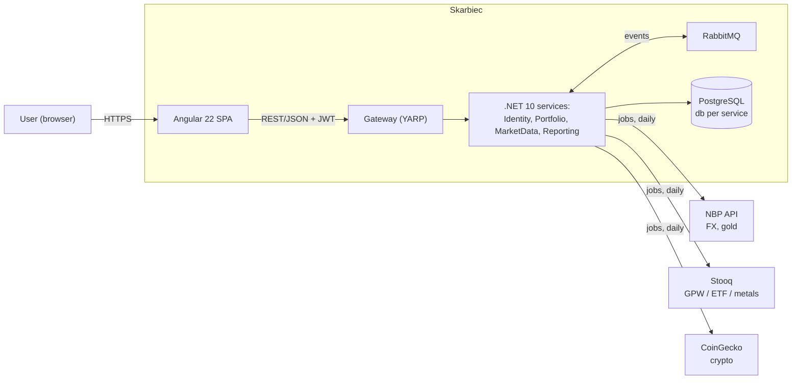
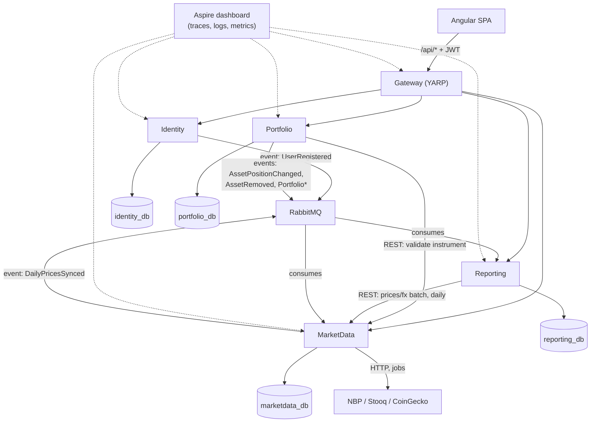
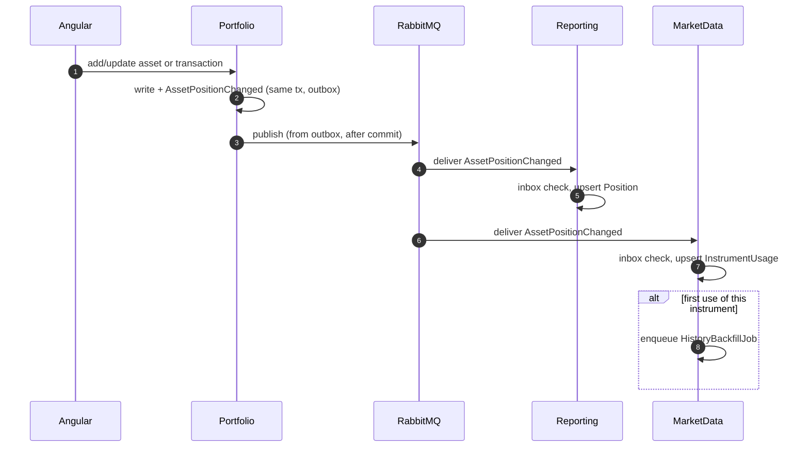
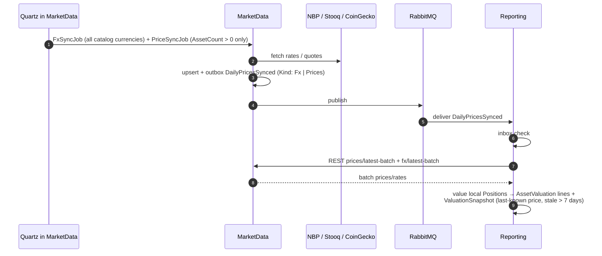
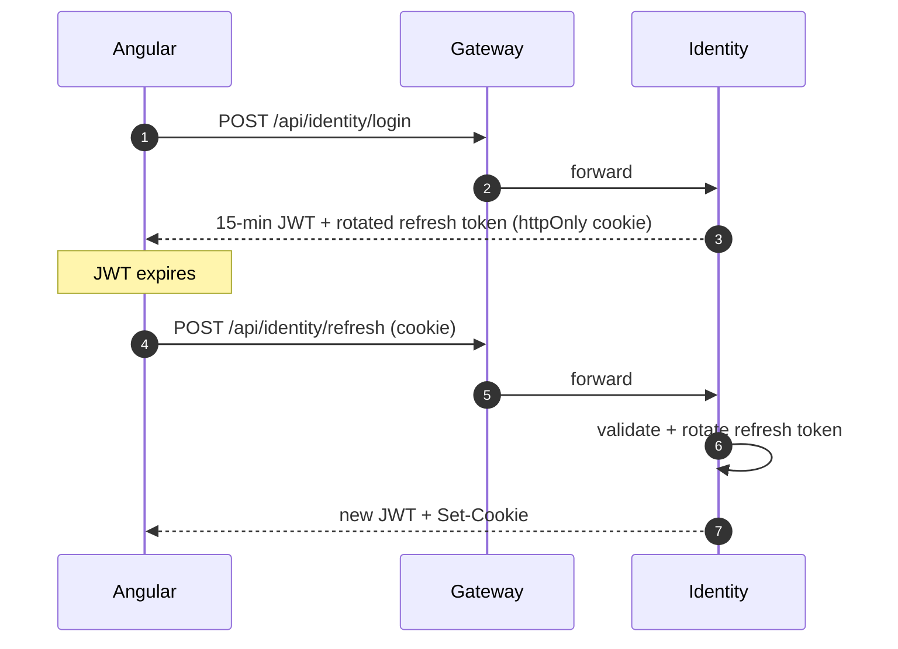
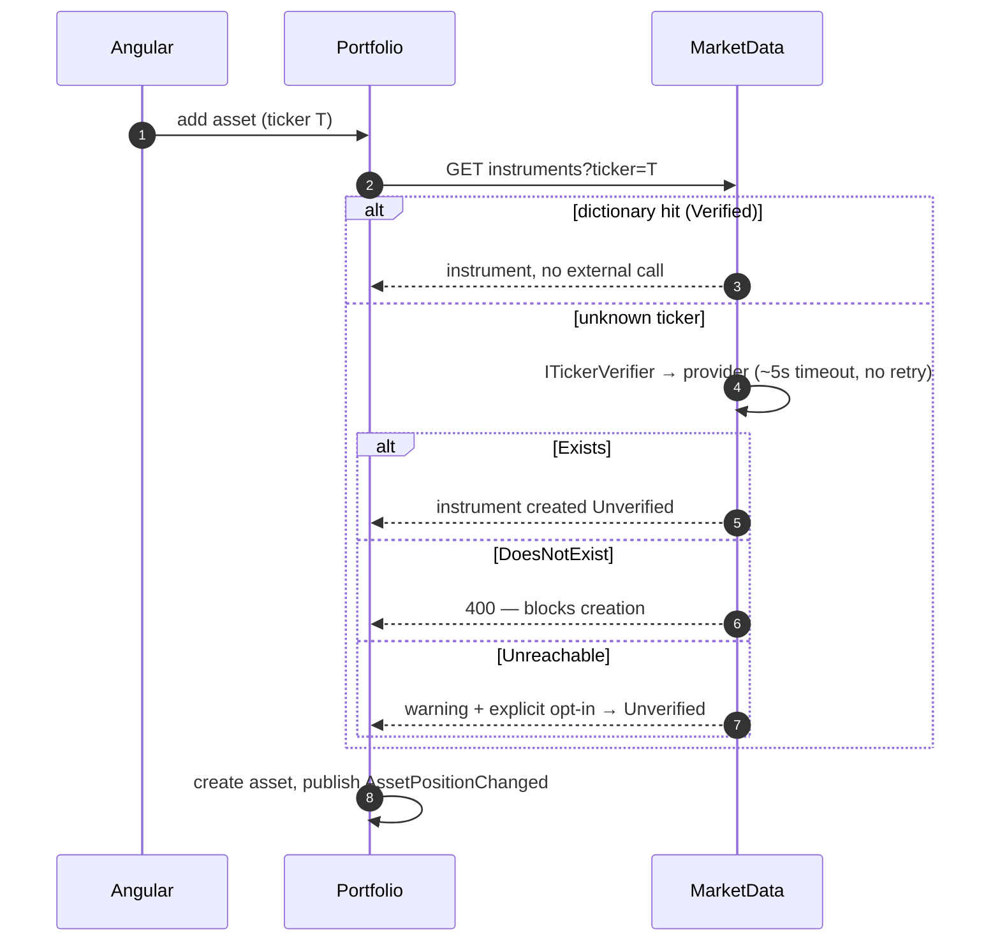

# Architecture

Target state (the approved redesign, Część II). Four services + gateway — Strategy folds into Reporting (ADR-020). See `decisions.md` for the ADRs this implements and "Current vs target" below for what still separates `master` from this document.

## Services

| Service | Responsibility | Database | Publishes | Consumes |
|---|---|---|---|---|
| **Gateway** (YARP) | routing `/api/<service>/*`, JWT validation, rate limiting, CORS | — | — | — |
| **Identity** | registration, login, refresh/logout | `identity_db` | `UserRegistered` | — |
| **Portfolio** | portfolios, assets (3 valuation modes), transactions = source of truth for quantity | `portfolio_db` | `AssetPositionChanged`, `AssetRemoved`, `PortfolioArchived`, `PortfolioRestored`, `PortfolioDeleted` | — |
| **MarketData** | currency catalog, instruments, FX rates, quotes, sync jobs, ticker verification (ADR-018) | `marketdata_db` | `DailyPricesSynced` | `AssetPositionChanged`, `AssetRemoved` (→ `InstrumentUsage`) |
| **Reporting** | positions read model, valuations (snapshots + per-asset lines), dashboard, history, insights (allocation, rebalancing, emergency fund, goals) | `reporting_db` | later: `AllocationDriftDetected`, `EmergencyFundBelowThreshold` | `AssetPositionChanged`, `AssetRemoved`, `Portfolio*`, `DailyPricesSynced` |

Angular talks only to the Gateway (ADR-013).

## Communication rules (ADR-021)

- **Domain facts travel as events with full state** (event-carried state transfer), through the MassTransit EF outbox; consumers are idempotent (inbox, dedup by `MessageId`). A consumer never calls back to the publisher over REST to fill in what the event didn't carry.
- **REST between services survives in exactly two places**: (1) request-path validation — Portfolio → MarketData `GET instruments/{id}` when creating a market asset; (2) a once-daily batch — Reporting → MarketData `prices/latest-batch` + `fx/latest-batch`, called from the snapshot consumer. `SystemCaller` auth is scoped to these two MarketData endpoints only.
- **Insights are computed locally** in Reporting from `AssetValuation`, as of the last snapshot — no fan-out on page load; a "Sync now" button re-triggers the sync jobs.
- **gRPC is withdrawn from the plan** (ADR-022) — the Strategy→Portfolio route disappears along with Strategy itself. A Reporting→MarketData batch exercise remains a candidate in `ideas.md`, not a commitment.

## Events (`Skarbiec.Contracts.Events`)

| Event | Payload | Published when |
|---|---|---|
| `AssetPositionChanged` | `AssetId, PortfolioId, UserId, AssetClass, ValuationMode, InstrumentId?, Currency, Quantity, ManualValueAmount?, ManualValueDate?, PortfolioIsArchived, Version` | after **every** position mutation: add/update asset, record/update/delete transaction |
| `AssetRemoved` | `AssetId, PortfolioId, UserId` | remove asset |
| `PortfolioArchived` / `PortfolioRestored` / `PortfolioDeleted` | `PortfolioId, UserId` | the matching slice (`Restore` is a new slice — no "unarchive" exists today) |
| `DailyPricesSynced` | as today, plus `Kind: Prices \| Fx` | end of a sync job |
| `UserRegistered` | as today | no consumer yet (Notifications is an idea, not built) |

`AssetChanged` and `TransactionRecorded` are removed — today they have no consumers and don't carry full state. Contracts are edited in place, no `V2` types (ADR-019).

## Current vs target

| Today (`master`) | Target | Closed by |
|---|---|---|
| Reporting pulls positions from Portfolio over REST (`SystemCaller`) on every snapshot | Reporting keeps a local `Position` read model fed by `AssetPositionChanged`/`AssetRemoved`/`Portfolio*` | spec-02, spec-03 |
| `ValuationSnapshot.BreakdownJson` (JSONB) | per-asset `AssetValuation` lines; the breakdown becomes `GROUP BY AssetClass` over lines | spec-03 |
| `AssetChanged`/`TransactionRecorded` publish with no consumers; updating or deleting a transaction publishes nothing | replaced by `AssetPositionChanged`/`AssetRemoved` from every mutating slice | spec-02 |
| `PriceSyncJob` syncs every dictionary instrument | syncs only instruments with `InstrumentUsage.AssetCount > 0` | spec-04 |
| History backfill on first use of an *existing* instrument isn't wired | `HistoryBackfillJob` fires from the `InstrumentUsage` consumer on first use | spec-04 |
| No currency catalog; FX sync covers supported currencies ad hoc | `Currency` catalog + `FxSyncJob` (daily; 12-month backfill on first run) | spec-04 |
| Strategy service exists as an empty skeleton | removed; its future features live in Reporting | spec-01 |
| `Portfolio.AssetCount` / `Asset.TransactionCount` counters; unused `ApplicationUser.BaseCurrency` | removed — delete guards use `AnyAsync`; PLN is the only base currency everywhere (ADR-008) | spec-02, spec-05 |
| 3/5/7/1 migrations per service, carrying task-history names | one `InitialCreate` migration per service (ADR-019) | spec-06 |
| Worktree branch `worktree-marketdata-currency-redesign` (a currency catalog + `FxSyncJob` prototype) | superseded by spec-04's design (no fallback rate) | delete after spec-04 merges |

## Diagrams

### C4 context

### Container

Solid = REST/HTTP (Gateway routing and the two narrow inter-service exceptions above); `event:`-labeled = RabbitMQ/MassTransit; dotted = Aspire telemetry, not a data dependency.

### Sequence: asset mutation → position + usage

### Sequence: sync jobs → snapshot

### Sequence: login → refresh

### Sequence: add market asset with ticker verification

## Local orchestration

.NET Aspire (`Skarbiec.AppHost`) runs Postgres (one instance, a database + scoped role per service), RabbitMQ, every service and the Gateway, with a dashboard for traces/logs/metrics. `dotnet run --project Skarbiec.AppHost` is the F5 entry point.

## Observability

OpenTelemetry in every service (traces, logs, metrics), W3C `traceparent` propagated over HTTP and RabbitMQ (MassTransit does this automatically). Aspire dashboard locally; `/health/live` and `/health/ready` in every service. Production observability (Grafana/Tempo/Loki/Prometheus) is an idea, not built — see `ideas.md`.

## Deployment status

VPS deployment (docker compose) is deferred — `deploy/README.md` documents local Aspire only; the compose/VPS half of `deploy/` doesn't exist yet. Development and CI both run local-only.

## What we deliberately do not do

- Service discovery — addresses come from Aspire/compose DNS.
- A saga/process manager — no flow needs one yet.
- A separate cache (Redis) — measure first, cache later.
- Kubernetes, before docker compose actually starts to hurt (k3s is a later idea, not a plan).
- gRPC anywhere in the current plan (ADR-022).
