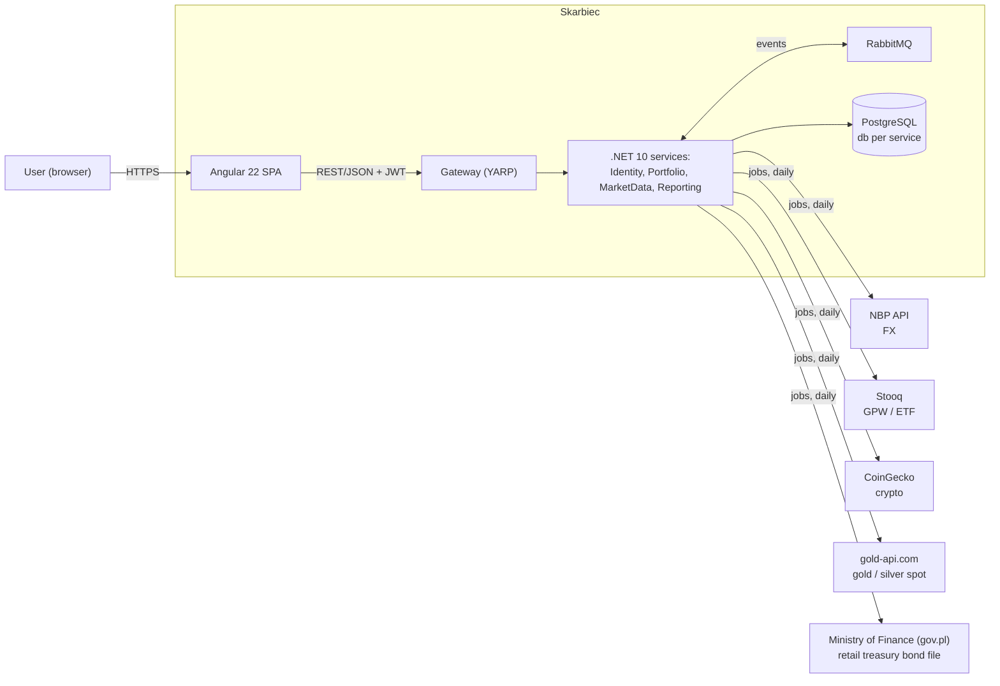
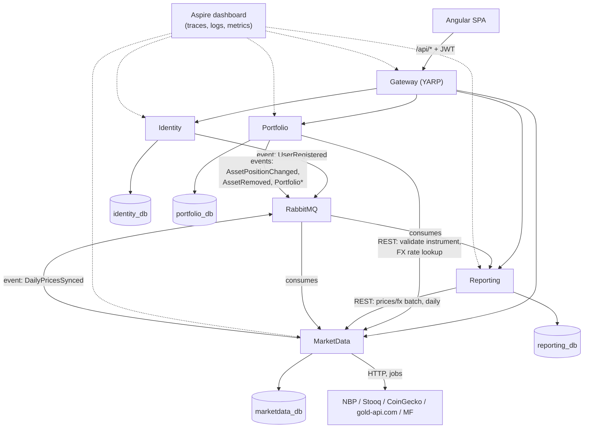
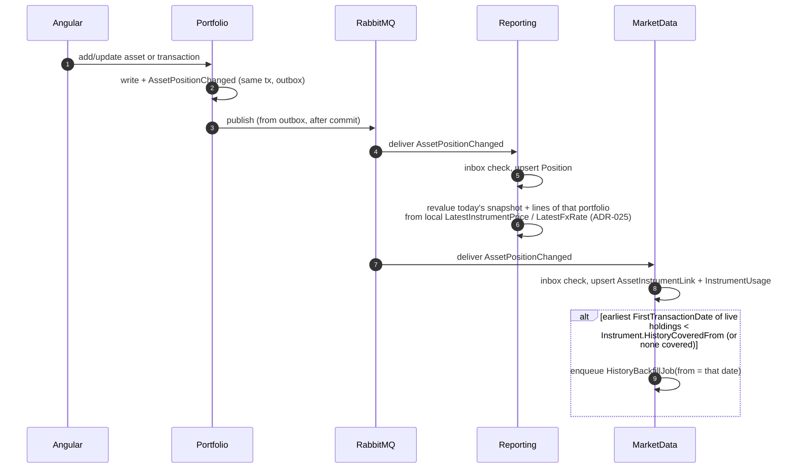
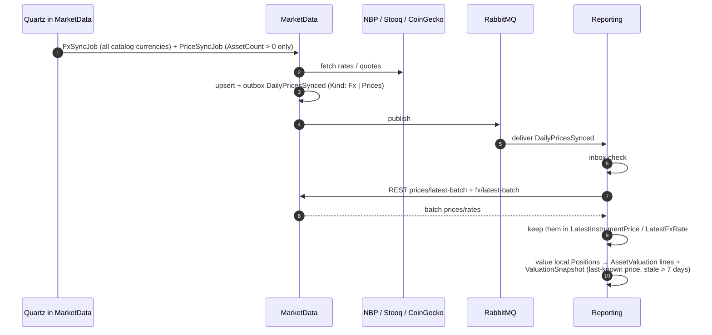
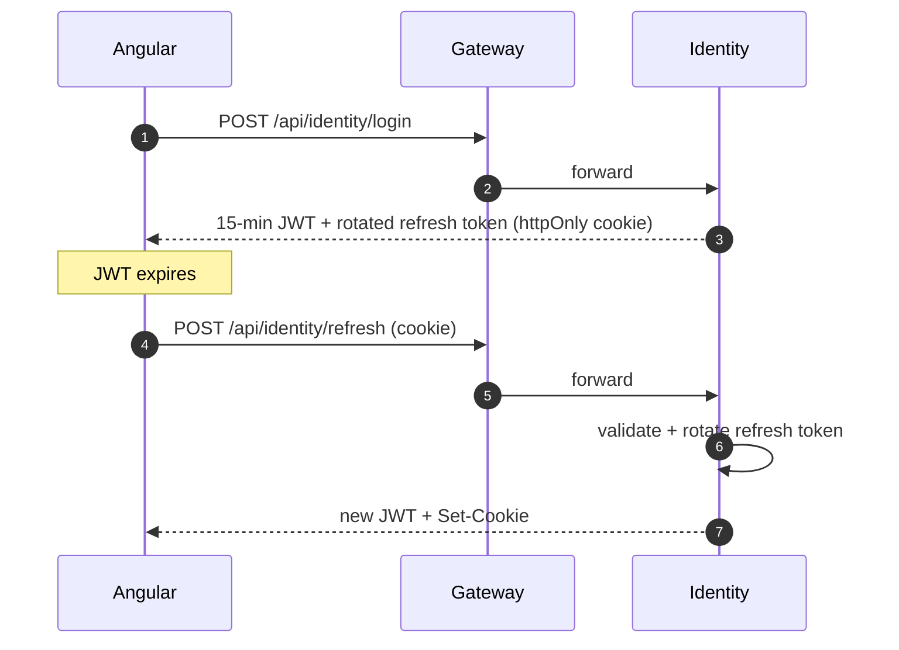

# Architecture

Target state (the approved redesign, Część II). Four services + gateway — Strategy folds into Reporting (ADR-020). See `decisions.md` for the ADRs this implements and "Current vs target" below for what still separates `master` from this document.

## Services

| Service | Responsibility | Database | Publishes | Consumes |
|---|---|---|---|---|
| **Gateway** (YARP) | routing `/api/<service>/*`, JWT validation, rate limiting, CORS | — | — | — |
| **Identity** | registration, login, refresh/logout | `identity_db` | `UserRegistered` | — |
| **Portfolio** | portfolios, assets (3 valuation modes), transactions = source of truth for quantity | `portfolio_db` | `AssetPositionChanged`, `AssetRemoved`, `PortfolioArchived`, `PortfolioRestored`, `PortfolioDeleted` | — |
| **MarketData** | currency catalog, instruments, FX rates, quotes, sync jobs, ticker verification (ADR-018) | `marketdata_db` | `DailyPricesSynced` | `AssetPositionChanged`, `AssetRemoved` (→ `InstrumentUsage`) |
| **Reporting** | positions read model, valuations (snapshots + per-asset lines), dashboard, history, insights (allocation, rebalancing, emergency fund, goals) | `reporting_db` | later: `AllocationDriftDetected`, `EmergencyFundBelowThreshold` | `AssetPositionChanged`, `AssetRemoved`, `Portfolio*`, `DailyPricesSynced` |

Angular talks only to the Gateway (ADR-013).

## Communication rules (ADR-021)

- **Domain facts travel as events with full state** (event-carried state transfer), through the MassTransit EF outbox; consumers are idempotent (inbox, dedup by `MessageId`). A consumer never calls back to the publisher over REST to fill in what the event didn't carry.
- **REST between services survives in exactly five places**: (1) request-path validation — Portfolio → MarketData `GET /internal/instruments/{id}` when creating a market asset; (2) a once-daily batch — Reporting → MarketData `POST /internal/prices/latest-batch` + `/internal/fx/latest-batch`, called from the snapshot consumer, and `POST /internal/prices/history-batch` + `/internal/fx/history-batch` (every quote or rate in a date range plus the last one before it) for the net worth history rebuild; (3) a request-path FX rate lookup — Portfolio → MarketData `GET /internal/fx/{currency}/rate?date=` when a transaction on a non-PLN asset is recorded or updated, to freeze its transaction-date PLN rate, with the same fail-closed 503 as the instrument lookup (ADR-026); (4) a read-path bond-rate lookup — Portfolio → MarketData `POST /internal/bond-series/rates-batch` with the distinct series codes, once per `ListBonds`/`GetBond` that needs a catalog rate, failing soft: MarketData unreachable leaves the bond's value-today estimate `null` with `MarketDataUnavailable` and the read still answers 200 (ADR-028). (5) a read-path securities quote lookup — Portfolio → MarketData `POST /internal/instruments/batch` (ticker, name, exchange, quote currency, last close per instrument id) plus `/internal/fx/latest-batch` for the distinct non-PLN currencies, once per `ListSecurities`, failing soft the same way: `null` prices with `MarketDataUnavailable`, the read still 200 (ADR-031). Service-only endpoints live under `/internal/**` (mapped through `MapInternalGroup`): anonymous, absent from OpenAPI, serving global data only, and unreachable through the Gateway, which routes only `/api/<service>/**`. Callers send no token — isolation is the network's job (ADR-027).
- **Insights are computed locally** in Reporting from `AssetValuation`, as of the last snapshot — no fan-out on page load; a "Sync now" button re-triggers the sync jobs.
- **gRPC is withdrawn from the plan** (ADR-022) — the Strategy→Portfolio route disappears along with Strategy itself. A Reporting→MarketData batch exercise remains a candidate in `ideas.md`, not a commitment.

## Events (`Skarbiec.Contracts.Events`)

| Event | Payload | Published when |
|---|---|---|
| `AssetPositionChanged` | `AssetId, PortfolioId, UserId, AssetClass, ValuationMode, InstrumentId?, Currency, Quantity, ManualValueAmount?, ManualValueDate?, FirstTransactionDate?, QuantityHistory (end-of-day `(Date, Quantity)` per transaction date), PortfolioIsArchived, IsArchived, Version` | after **every** position mutation: add/update asset, record/update/delete transaction, archive/restore the asset (`IsArchived`, asset-archive) or its portfolio (fan-out) |
| `AssetRemoved` | `AssetId, PortfolioId, UserId, CascadedFromPortfolio` | remove asset (its transactions go with it); also one per asset on portfolio delete, flagged `CascadedFromPortfolio` so Reporting skips the revaluation (spec-08) |
| `PortfolioArchived` / `PortfolioRestored` / `PortfolioDeleted` | `PortfolioId, UserId` | the matching slice (`Restore` is a new slice — no "unarchive" exists today); `PortfolioDeleted` cascades to the assets and their transactions and is accompanied by one `AssetRemoved` per asset (spec-08) |
| `DailyPricesSynced` | as today, plus `Kind: Prices \| Fx` | end of a sync job |
| `InstrumentHistoryBackfilled` | `InstrumentId, From, To, OccurredAtUtc` (the clamped window the backfill fetched) | `HistoryBackfillJob` finishes with quotes stored (not on NoData or Error) |
| `UserRegistered` | as today | no consumer yet (Notifications is an idea, not built) |

`AssetChanged` and `TransactionRecorded` are removed — today they have no consumers and don't carry full state. Contracts are edited in place, no `V2` types (ADR-019).

## Current vs target

| Today (`master`) | Target | Closed by |
|---|---|---|
| `AssetChanged`/`TransactionRecorded` publish with no consumers; updating or deleting a transaction publishes nothing | replaced by `AssetPositionChanged`/`AssetRemoved` from every mutating slice | spec-02 |
| Strategy service exists as an empty skeleton | removed; its future features live in Reporting | spec-01 |
| `Portfolio.AssetCount` / `Asset.TransactionCount` counters; unused `ApplicationUser.BaseCurrency` | removed — deletes cascade in the handler (spec-08); PLN is the only base currency everywhere (ADR-008) | spec-02, spec-05, spec-08 |
| 3/5/7/1 migrations per service, carrying task-history names | one `InitialCreate` migration per service (ADR-019) | spec-06 |
| Worktree branch `worktree-marketdata-currency-redesign` (a currency catalog + `FxSyncJob` prototype) | superseded by spec-04's design (no fallback rate) | delete after spec-04 merges |

## Diagrams

### C4 context

```mermaid
flowchart LR
    U["User (browser)"]
    subgraph SKARBIEC["Skarbiec"]
        SPA["Angular 22 SPA"]
        GW["Gateway (YARP)"]
        SVC[".NET 10 services:<br/>Identity, Portfolio, MarketData, Reporting"]
        MQ["RabbitMQ"]
        DB[("PostgreSQL<br/>db per service")]
    end
    NBP["NBP API<br/>FX"]
    STOOQ["Stooq<br/>GPW / ETF"]
    CG["CoinGecko<br/>crypto"]
    GA["gold-api.com<br/>gold / silver spot"]
    MF["Ministry of Finance (gov.pl)<br/>retail treasury bond file"]

    U -->|HTTPS| SPA
    SPA -->|"REST/JSON + JWT"| GW
    GW --> SVC
    SVC <-->|events| MQ
    SVC --> DB
    SVC -->|"jobs, daily"| NBP
    SVC -->|"jobs, daily"| STOOQ
    SVC -->|"jobs, daily"| CG
    SVC -->|"jobs, daily"| GA
    SVC -->|"jobs, daily"| MF
```

### Container

```mermaid
flowchart TB
    SPA["Angular SPA"] -->|"/api/* + JWT"| GW["Gateway (YARP)"]
    GW --> ID["Identity"]
    GW --> PF["Portfolio"]
    GW --> MD["MarketData"]
    GW --> RP["Reporting"]

    PF -->|"REST: validate instrument,<br/>FX rate lookup"| MD
    RP -->|"REST: prices/fx batch, daily"| MD

    ID -->|"event: UserRegistered"| MQ["RabbitMQ"]
    PF -->|"events: AssetPositionChanged,<br/>AssetRemoved, Portfolio*"| MQ
    MD -->|"event: DailyPricesSynced"| MQ
    MQ -->|consumes| MD
    MQ -->|consumes| RP

    ID --> IDB[("identity_db")]
    PF --> PDB[("portfolio_db")]
    MD --> MDB[("marketdata_db")]
    RP --> RDB[("reporting_db")]

    MD -->|"HTTP, jobs"| EXT["NBP / Stooq / CoinGecko / gold-api.com / MF"]

    ASPIRE["Aspire dashboard<br/>(traces, logs, metrics)"]
    ASPIRE -.-> GW & ID & PF & MD & RP
```

Solid = REST/HTTP (Gateway routing and the three narrow inter-service exceptions above); `event:`-labeled = RabbitMQ/MassTransit; dotted = Aspire telemetry, not a data dependency.

### Sequence: asset mutation → position + usage

```mermaid
sequenceDiagram
    autonumber
    participant U as Angular
    participant PF as Portfolio
    participant MQ as RabbitMQ
    participant RP as Reporting
    participant MD as MarketData

    U->>PF: add/update asset or transaction
    PF->>PF: write + AssetPositionChanged (same tx, outbox)
    PF->>MQ: publish (from outbox, after commit)
    MQ->>RP: deliver AssetPositionChanged
    RP->>RP: inbox check, upsert Position
    RP->>RP: revalue today's snapshot + lines of that portfolio<br/>from local LatestInstrumentPrice / LatestFxRate (ADR-025)
    MQ->>MD: deliver AssetPositionChanged
    MD->>MD: inbox check, upsert AssetInstrumentLink + InstrumentUsage
    alt earliest FirstTransactionDate of live holdings < Instrument.HistoryCoveredFrom (or none covered)
        MD->>MD: enqueue HistoryBackfillJob(from = that date)
    end
```

### Sequence: sync jobs → snapshot

```mermaid
sequenceDiagram
    autonumber
    participant Q as Quartz in MarketData
    participant MD as MarketData
    participant EXT as NBP / Stooq / CoinGecko
    participant MQ as RabbitMQ
    participant RP as Reporting

    Q->>MD: FxSyncJob (all catalog currencies) + PriceSyncJob (AssetCount > 0 only)
    MD->>EXT: fetch rates / quotes
    MD->>MD: upsert + outbox DailyPricesSynced (Kind: Fx | Prices)
    MD->>MQ: publish
    MQ->>RP: deliver DailyPricesSynced
    RP->>RP: inbox check
    RP->>MD: REST prices/latest-batch + fx/latest-batch
    MD-->>RP: batch prices/rates
    RP->>RP: keep them in LatestInstrumentPrice / LatestFxRate
    RP->>RP: value local Positions → AssetValuation lines +<br/>ValuationSnapshot (last-known price, stale > 7 days)
```

### Sequence: login → refresh

```mermaid
sequenceDiagram
    autonumber
    participant U as Angular
    participant GW as Gateway
    participant ID as Identity

    U->>GW: POST /api/identity/login
    GW->>ID: forward
    ID-->>U: 15-min JWT + rotated refresh token (httpOnly cookie)
    Note over U: JWT expires
    U->>GW: POST /api/identity/refresh (cookie)
    GW->>ID: forward
    ID->>ID: validate + rotate refresh token
    ID-->>U: new JWT + Set-Cookie
```

### Sequence: add market asset with ticker verification

```mermaid
sequenceDiagram
    autonumber
    participant U as Angular
    participant PF as Portfolio
    participant MD as MarketData

    U->>MD: GET instruments/search?q&assetClass (Stock/Etf, ≥ 2 chars)
    MD->>MD: local matches + IInstrumentSearchSource → provider (~5s, no retry, ADR-030)
    MD-->>U: local first, then provider candidates (id null); provider down → local + providerUnavailable
    opt picked a candidate
        U->>MD: POST instruments {ticker, name, assetClass} — exchange + currency from the suffix, known ticker → 200
    end
    U->>PF: add asset (ticker T)
    PF->>MD: GET instruments?ticker=T
    alt dictionary hit (Verified)
        MD-->>PF: instrument, no external call
    else unknown ticker
        MD->>MD: ITickerVerifier → provider (~5s timeout, no retry)
        alt Exists
            MD-->>PF: instrument created Unverified
        else DoesNotExist
            MD-->>PF: 400 — blocks creation
        else Unreachable
            MD-->>PF: warning + explicit opt-in → Unverified
        end
    end
    PF->>PF: create asset, publish AssetPositionChanged
```

## Local orchestration

.NET Aspire (`Skarbiec.AppHost`) runs Postgres (one instance, a database + scoped role per service), RabbitMQ, every service and the Gateway, with a dashboard for traces/logs/metrics. `dotnet run --project Skarbiec.AppHost` is the F5 entry point.

## Observability

OpenTelemetry in every service (traces, logs, metrics), W3C `traceparent` propagated over HTTP and RabbitMQ (MassTransit does this automatically). Aspire dashboard locally; `/health/live` and `/health/ready` in every service. Production observability (Grafana/Tempo/Loki/Prometheus) is an idea, not built — see `ideas.md`.

## Deployment status

A local docker compose stack exists (`deploy/compose/compose.yaml`, driven by `scripts/compose.mjs`, images rebuilt from the shipped commit by `ship.mjs`) — see `deploy/README.md` "Local: docker compose". VPS deployment is deferred: no registry, no remote host, no Production environment yet. Development and CI both run local-only.

## What we deliberately do not do

- Service discovery — addresses come from Aspire/compose DNS.
- A saga/process manager — no flow needs one yet.
- A separate cache (Redis) — measure first, cache later.
- Kubernetes, before docker compose actually starts to hurt (k3s is a later idea, not a plan).
- gRPC anywhere in the current plan (ADR-022).
