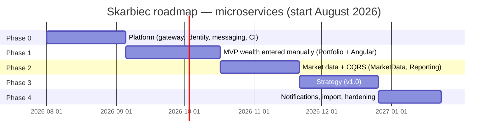

# 04 — Roadmap (microservices)

Assumption: after-hours work (~8–10 h/week). Order matters more than dates. Unchanged rule: **every phase ends with a deployment**. Microservices delay the start by ~4–6 weeks compared to a monolith — a conscious price of learning (ADR-001).

**Current status:** VPS/production deployment (docker compose, T0.18) is deferred — development happens locally only, under Aspire. The `[VPS]`-tagged tasks in `zadania/` (compose/VPS provisioning, backups, production observability, and the production half of every phase-exit task) are optional until that work is picked up; each phase closes with a **local** smoke test instead. This doesn't change the target architecture (ADR-011/014 still stand) — just the current execution order.

Tip for keeping momentum: in every phase, build a "path through the system" first (end-to-end through the Gateway down to the database), only then feature breadth.

## Phases

### Phase 0 — Platform (4–5 weeks) ← most of the infrastructure learning lives here

- Monorepo, structure: `services/`, `gateway/`, `contracts/`, `web/`, `deploy/`.
- .NET Aspire AppHost: PG (databases per service), RabbitMQ, all services, dashboard.
- YARP Gateway: routing per prefix, JWT validation, CORS, rate limiting.
- Identity service: registration, login, JWT + refresh; `UserRegistered` event through the outbox (the first full messaging flow!).
- Skeletons of the remaining services (health checks, OpenTelemetry, EF + migrations, query filter on `UserId`).
- CI: GitHub Actions with path filters (build/test/image only for changed services); compose deploy to a VPS.
- **Deliverable:** login through the Gateway in production; a trace passes Gateway→Identity in the Aspire dashboard.

### Phase 1 — MVP: wealth entered manually (5–7 weeks)

- Portfolio service: CRUD for portfolios and assets (manual valuation), transactions, position recalculation.
- Angular: layout, auth, portfolio/asset/transaction views; TS client generated from OpenAPI.
- Dashboard v1 (simple: data straight from Portfolio, pie chart per class).
- **Deliverable:** your entire wealth entered; a second user sees none of it (isolation tests).

### Phase 2 — Market data + CQRS (4–6 weeks) ← the most interesting "microservices" phase

- MarketData service: instruments, `IPriceSource` (NBP, Stooq, CoinGecko), Quartz `PriceSyncJob`, history backfill.
- `DailyPricesSynced` event (outbox) → Reporting computes snapshots (idempotent consumer, inbox).
- Reporting: dashboard read model + net-worth history chart; the dashboard switches from Portfolio to Reporting.
- Production observability: Grafana + Tempo + Loki + Prometheus; alert when the sync hasn't run for 2 days.
- **Deliverable:** valuations update on their own; a single trace shows job→event→consumer→write.

### Phase 3 — Strategy (4–5 weeks)

- Strategy service: target allocation, deviations, rebalancing (amount suggestions + "where should I deposit X PLN" mode), emergency fund, goals.
- Strategy→Portfolio over gRPC (exercise; the other routes stay on REST).
- **Deliverable:** the application advises. Version 1.0.

### Phase 4 — Convenience and trust (3–4 weeks)

- Notifications service (consumes events → e-mails: allocation drift, emergency-fund drop).
- CSV import (XTB + generic), data export (CSV/JSON).
- Annual report (simplified TWR, contributions vs growth).
- Hardening: backups of all databases (pg_dump + cron + restore test), rate limiting, security review.

### Phase 5 — Later (no commitments)

- Migration compose → **k3s** (a deliberate exercise: manifests, secrets, rolling update).
- Liabilities (loans), PIT-38/FIFO, Household, PWA, open banking.

## Timeline (approximate)

Realistically: **~6 months to version 1.0** working after hours.

## Risks and mitigation

| Risk                                               | Mitigation                                                                                                          |
| -------------------------------------------------- | ------------------------------------------------------------------------------------------------------------------- |
| Phase 0 grows endlessly (infra plumbing)           | hard 5-week limit; anything missing goes to the backlog, not into Phase 0                                           |
| Distributed complexity overwhelms a solo developer | Aspire + OTel from day 1 (debugging via traces, not logs from 7 consoles); few services (ADR-001)                   |
| Boilerplate duplicated in every service            | shared`Skarbiec.ServiceDefaults` project (OTel, health checks, auth, resilience) — Aspire has a pattern for this |
| MassTransit v8 stops being maintained              | `IEventBus` abstraction + POCO contracts; plan B: Rebus (ADR-012)                                                 |
| Stooq/CoinGecko changes its format                 | `IPriceSource` isolates the sources; prices in our own database — an outage = stale data                         |
| VPS cost higher than with a monolith               | one PG instance (ADR-003); 8 GB VPS ~30–40 €/month; memory limits in compose                                      |
| Loss of financial data                             | pg_dump of all databases from Phase 1, restore test once per phase                                                  |
| Scope creep                                        | ideas land in Phase 5, not in the current sprint                                                                    |
