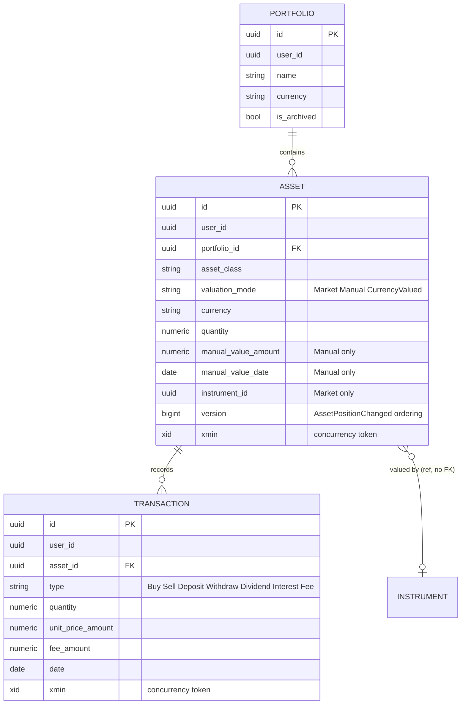
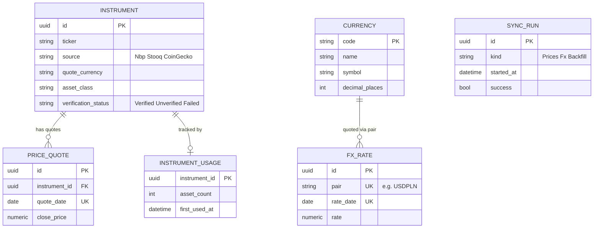
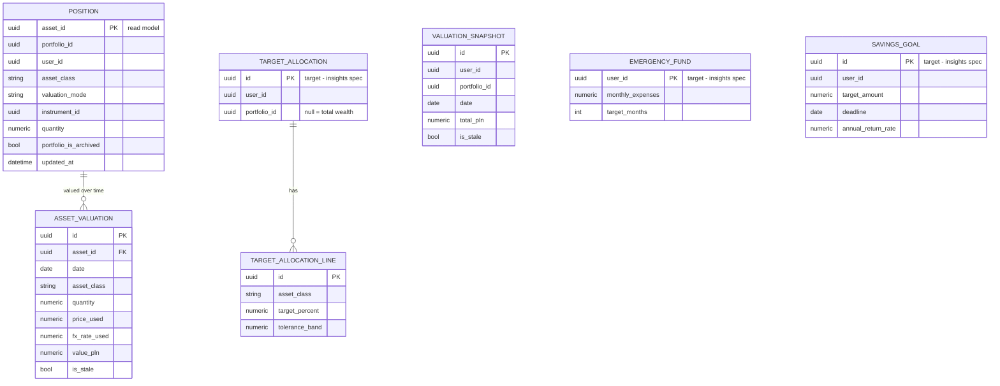

# Domain model

Target state (Część II.3). Items that don't exist on `master` yet are marked **(target — spec-0x)**; everything else is already true today. Cross-service references are marked "ref, no FK" — see the rule at the bottom.

## Asset classes and valuation modes

`AssetClass`: `Cash`, `Deposit`, `Stock`, `Etf`, `Bond`, `Crypto`, `PreciousMetal`, `RealEstate`, `Other`.

`AssetValuationMode` — three modes, explicit on `Asset.ValuationMode` (M1.4; before that, market-vs-manual was inferred from `InstrumentId is not null`, which had no way to express the third mode):

| Mode | Shape | Default classes |
|---|---|---|
| **Market** | points at an `Instrument` (ticker + source); value = quantity × last price × FX rate | Stock, Etf, Bond, Crypto, PreciousMetal |
| **Manual** | `ManualValueAmount` + `ManualValueDate`, refreshed by hand | RealEstate, Other |
| **Currency-valued** | no instrument, no manual value; value = quantity × FX rate for the asset's own currency (rate = 1 for PLN, so no lookup at all) | Cash, Deposit |

The class → default-mode mapping is a default, not a hard constraint — Market and Manual stay available to every class; only "neither instrument nor manual value" is gated by class, since that combination was always a validation error before Currency-valued existed.

## Identity (`identity_db`)

| Entity | Fields | Notes |
|---|---|---|
| `User` | Identity + `DisplayName` | `BaseCurrency` removed **(target — spec-05)** — unused, PLN is the only base currency (ADR-008) |
| `RefreshToken` | token hash, expiry, revoked | unchanged |

## Portfolio (`portfolio_db`)

| Entity | Fields | Changes vs today |
|---|---|---|
| `Portfolio` | `Id, UserId, Name, Description?, Currency, IsArchived` | `AssetCount` removed (spec-02) — delete guard is `Assets.AnyAsync` |
| `Asset` | `Id, UserId, PortfolioId, AssetClass, ValuationMode, Name, Currency, Quantity, ManualValueAmount?, ManualValueDate?, InstrumentId?, Version, xmin` | `ValuationMode` already explicit (M1.4); `TransactionCount` removed (spec-02) — delete guard is `Transactions.AnyAsync`; `Version` is the per-asset event-ordering counter `PositionEventPublisher` bumps (not `xmin`, which doesn't move on the archive/restore fan-out) |
| `Transaction` | `Id, UserId, AssetId, Type, Quantity, UnitPriceAmount, FeeAmount, Date, xmin` | unchanged |

Every slice that mutates a position publishes `AssetPositionChanged` in the same transaction as the write (spec-02); removal publishes `AssetRemoved`, and archive/restore publish `PortfolioArchived`/`PortfolioRestored` plus one `AssetPositionChanged` per asset carrying the new archived flag.



## MarketData (`marketdata_db`)

| Entity | Fields | Role |
|---|---|---|
| `Currency` | `Code (PK), Name, Symbol, DecimalPlaces, DisplayOrder` | no `FallbackRateToPln`, no `IsPivot` (PLN is the fixed base). Seed: PLN, EUR, USD, GBP, CHF |
| `Instrument` | `Id, Ticker, Name, Source, QuoteCurrency, AssetClass, VerificationStatus` | unchanged; `QuoteCurrency` is unconstrained (whatever the provider quotes) |
| `PriceQuote` | `InstrumentId, Date, ClosePrice` — unique (instrument, date) | unchanged |
| `FxRate` | `Pair (e.g. USDPLN), Date, Rate` — unique (pair, date) | unchanged |
| `SyncRun` | + `Kind: Prices \| Fx \| Backfill` | one log shape for all three jobs |
| `InstrumentUsage` | `InstrumentId (PK), AssetCount, FirstUsedAt` | derived from `AssetInstrumentLink`; `PriceSyncJob` syncs only `AssetCount > 0` |
| `AssetInstrumentLink` | `AssetId (PK), InstrumentId?, Version, IsRemoved` | per-asset state from the `AssetPositionChanged`/`AssetRemoved` consumers — makes them idempotent and order-safe (version compare, terminal `IsRemoved` tombstone) |

Jobs: `FxSyncJob` daily over every catalog currency, 12-month backfill on a currency's first run; `PriceSyncJob` syncs only instruments in use; `HistoryBackfillJob` fires for a newly created custom instrument and from the `InstrumentUsage` consumer on an instrument's first use. All three write a `SyncRun` and respect `Testing:DisableBackgroundJobs`.



## Reporting (`reporting_db`)

| Entity | Fields | Role |
|---|---|---|
| `Position` | copy of the `AssetPositionChanged` payload + `UpdatedAt`; `AssetId` is the primary key | upserted from the inbox; `PortfolioIsArchived` kept current from `Portfolio*` events |
| `ValuationSnapshot` | `Id, UserId, PortfolioId, Date, TotalPln, IsStale` | breakdown is a `GROUP BY AssetClass` over `AssetValuation` lines, not a stored JSON blob |
| `AssetValuation` | `Id, UserId, PortfolioId, AssetId, Date, AssetClass, Quantity, PriceUsed?, PriceDate?, FxRateUsed?, ValuePln, IsStale`; unique `(AssetId, Date)` | the basis for P/L per asset, emergency fund and goal math, and TWR — nothing needs recomputing from scratch |
| `TargetAllocation` + `TargetAllocationLine` | scope (`PortfolioId?`, null = total), lines `AssetClass → TargetPercent, ToleranceBand`; unique `(UserId, PortfolioId?)` | **(target — insights spec, after spec-03)** |
| `EmergencyFund` + `EmergencyFundAsset` | `MonthlyExpenses, TargetMonths` + designated assets, validated locally against `Position` | **(target — insights spec)** |
| `SavingsGoal` + `SavingsGoalAsset` | `Name, TargetAmount, Deadline, AnnualReturnRate` + linked assets | **(target — insights spec)** |

Insight math (`AllocationMath`, `RebalancingMath`, `ContributionPlanMath`, `EmergencyFundMath`, `GoalMath`) is pure functions over `AssetValuation` — no I/O, no re-fetching prices.



## Valuation algorithm

```
asset value (PLN) =
  if Market:            Quantity × last PriceQuote × FxRate(quote currency → PLN, same date)
  if Manual:             ManualValueAmount × FxRate(currency → PLN, snapshot date)
  if Currency-valued:   Quantity × FxRate(currency → PLN, snapshot date)

portfolio value = Σ assets ; net worth = Σ portfolios
```

No price for a given day → use the last known one (weekends, holidays); mark `IsStale` when the price or rate used is more than 7 days old. Unchanged by the redesign — only *where* it runs moves, from Reporting querying Portfolio/MarketData live to Reporting valuing its own `Position` rows against a daily price/FX batch.

## Invariants

- `TargetAllocationLine` percentages within one allocation sum to exactly 100.
- A `Sell` transaction cannot take asset quantity below 0, checked across the asset's full transaction history.
- Amounts and quantities ≥ 0; fees ≥ 0.
- One `PriceQuote` per (instrument, date); one `FxRate` per (pair, date) — unique indexes.
- Every user-owned entity carries `UserId` from the JWT — enforced by an architecture test, never trusted from the request body (ADR-006).
- A user-chosen currency (`Portfolio.Currency`, `Asset.Currency`) is one of `SupportedCurrencies` (PLN/EUR/USD, default PLN, canonical uppercase) — validated on write only; this does not constrain `Instrument.QuoteCurrency` or `FxRate.Pair`.
- `Asset.ValuationMode` is exactly one of Market / Manual / Currency-valued, enforced by request validation, not a DB constraint.

## Conscious simplifications

- **Single-entry transactions**: `Dividend`/`Interest` do not create an offsetting cash-asset flow — they record that income happened, not where the cash landed. Modeling a full double-entry ledger was judged not worth it for a personal-use app.
- **Fees in the asset's own currency**: a `Transaction.FeeAmount` is denominated in `Asset.Currency`, never a separate currency — avoids a second FX lookup per transaction.
- **PLN-only base currency**: every valuation ends in PLN (ADR-008); there is no per-user reporting currency.

## Cross-service reference rule (ADR-003)

A reference to another service's entity (`Asset.InstrumentId` → MarketData, `Position.AssetId`/`PortfolioId` → Portfolio) is a plain `Guid` column with **no foreign key and no navigation property** — consistency is enforced by the API/event contract, not the database. This is a deliberate, accepted cost of database-per-service: a dangling reference is a valid state (e.g. an asset deleted in Portfolio after Reporting already has a `Position` row for it) and every reader must treat it as a normal case, not a bug.
