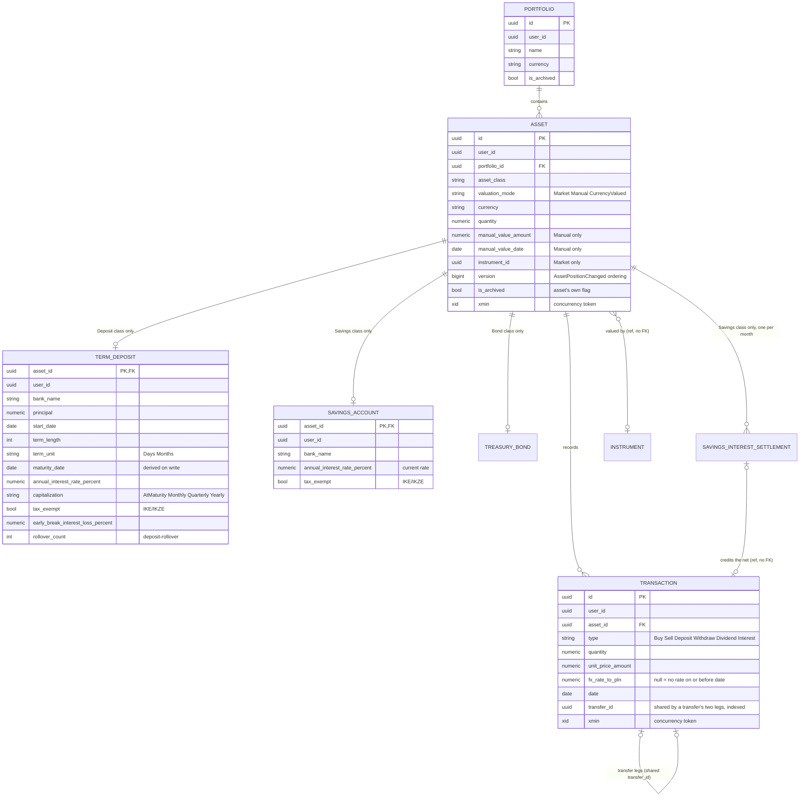
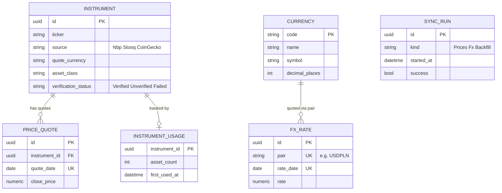
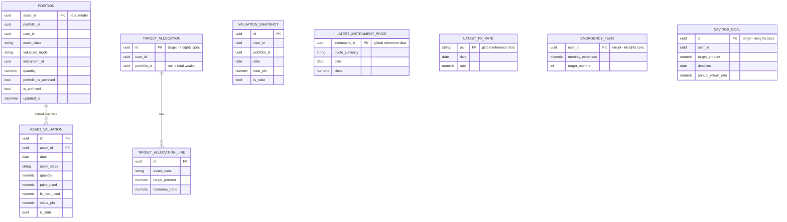

# Domain model

Target state (Część II.3). Items that don't exist on `master` yet are marked **(target — spec-0x)**; everything else is already true today. Cross-service references are marked "ref, no FK" — see the rule at the bottom.

## Asset classes and valuation modes

`AssetClass`: `Cash`, `Deposit`, `Stock`, `Etf`, `Bond`, `Crypto`, `PreciousMetal`, `RealEstate`, `Other`, `Savings` (appended, so the stored ints stay stable).

`AssetValuationMode` — three modes, explicit on `Asset.ValuationMode` (M1.4; before that, market-vs-manual was inferred from `InstrumentId is not null`, which had no way to express the third mode):

| Mode | Shape | Default classes |
|---|---|---|
| **Market** | points at an `Instrument` (ticker + source); value = quantity × last price × FX rate | Stock, Etf, Crypto, PreciousMetal |
| **Manual** | `ManualValueAmount` + `ManualValueDate`, refreshed by hand | RealEstate, Other |
| **Currency-valued** | no instrument, no manual value; value = quantity × FX rate for the asset's own currency (rate = 1 for PLN, so no lookup at all) | Cash, Deposit, Savings, Bond |

The class → default-mode mapping is a default, not a hard constraint — Market and Manual stay available to every class; only "neither instrument nor manual value" is gated by class, since that combination was always a validation error before Currency-valued existed.

## Identity (`identity_db`)

| Entity | Fields | Notes |
|---|---|---|
| `User` | Identity + `DisplayName` | `BaseCurrency` removed **(target — spec-05)** — unused, PLN is the only base currency (ADR-008) |
| `RefreshToken` | token hash, expiry, revoked | unchanged |

## Portfolio (`portfolio_db`)

| Entity | Fields | Changes vs today |
|---|---|---|
| `Portfolio` | `Id, UserId, Name, Description?, Currency, IsArchived` | `AssetCount` removed (spec-02); delete cascades to its assets and their transactions in the handler (spec-08) |
| `Asset` | `Id, UserId, PortfolioId, AssetClass, ValuationMode, Name, Currency, Quantity, ManualValueAmount?, ManualValueDate?, InstrumentId?, Version, IsArchived, xmin` | `ValuationMode` already explicit (M1.4); `TransactionCount` removed (spec-02); delete cascades to its transactions in the handler (spec-08); `Version` is the per-asset event-ordering counter `PositionEventPublisher` bumps (not `xmin`, which doesn't move on the archive/restore fan-out); `IsArchived` is the asset's own archive flag, independent of its portfolio's (asset-archive) |
| `Transaction` | `Id, UserId, AssetId, Type, Quantity, UnitPriceAmount, FxRateToPln?, Date, TransferId?, xmin` | `FeeAmount` removed; `FxRateToPln` is the `{Asset.Currency}PLN` rate frozen at write time — the latest MarketData rate on or before `Date`, `1` for PLN, `null` when MarketData has none that early (ADR-026); `TransferId` (indexed, asset-transfers-deposit-funding) links the two legs of a transfer, `null` on an ordinary or detached transaction |
| `TermDeposit` | `AssetId (PK, FK → Asset), UserId, BankName?, Principal, StartDate, TermLength, TermUnit (Days \| Months), MaturityDate, AnnualInterestRatePercent, Capitalization (AtMaturity \| Monthly \| Quarterly \| Yearly), TaxExempt, EarlyBreakInterestLossPercent, SettledOn?, SettledGrossInterest?, SettledTax?, RolloverCount` | new (term-deposits): the terms of a Deposit-class asset, 1:1 with it and the one real FK in `portfolio_db` (cascade delete); `MaturityDate` is derived on every write; the projection (`DepositInterestMath`: actual/365, gross per capitalisation period rounded half-away-from-zero to grosze, 19 % Belka tax per period rounded up, net compounded) and the `Active \| Due \| Settled \| PaidOut` status (Europe/Warsaw date; Settled wins over Due, PaidOut over Settled — a settled deposit with a `Withdraw` is paid out, deposit-payout-to-cash) are computed at read time, never stored; the three `Settled*` fields (term-deposits-settlement) record what the bank actually paid, set together by `SettleDeposit` and null until then; `RolloverCount` (deposit-rollover, default 0) counts the terms `RollOverDeposit` started, stored rather than derived from the transactions |
| `SavingsAccount` | `AssetId (PK, FK → Asset), UserId, BankName?, AnnualInterestRatePercent, TaxExempt` | new (savings-accounts): the terms of a Savings-class asset, 1:1 with it and FK-cascaded like `TermDeposit`; `AnnualInterestRatePercent` is the current rate (no history); the balance is `Asset.Quantity`, moved only by the asset's ordinary transactions |
| `TreasuryBond` | `AssetId (PK, FK → Asset), UserId, SeriesCode, Type (TreasuryBondType), PurchaseDate, BondCount, PurchasePricePerBond, FirstPeriodRatePercent, MarginPercent?, EarlyRedemptionFeePerBond, TaxExempt, MaturityDate, SwappedFromAssetId?` | new (bond-purchase): the terms of a Bond-class asset — one purchase lot of a retail treasury bond — 1:1 with it and FK-cascaded like `TermDeposit`; `MaturityDate` is derived on every write by `BondSchedule`; the interest periods and the `Active \| InterestDue \| Matured \| Redeemed` status are computed at read time, never stored; `SwappedFromAssetId` (bond-maturity-swap) is the matured bond a swap bought it with — a plain id, no FK, cleared when that bond is removed |
| `SavingsInterestSettlement` | `Id, UserId, AssetId, PeriodStart, PeriodEnd, GrossInterest, Tax, TransactionId?` | new (savings-interest-settlement): one settled calendar month of a savings account's interest — what the bank paid, fixed once stored; unique `(AssetId, PeriodEnd)`; `TransactionId` is the system-managed `Deposit` crediting the net, `null` when the net is 0; no FK — `RemoveAsset` and `DeletePortfolio` delete it in the handler |
| `BondInterestSettlement` | `Id, UserId, AssetId, PeriodIndex, PeriodStart, PeriodEnd, RatePercent, BondCount, GrossInterest, Tax, CreditTransactionId?, TransferId?` | new (bond-interest-periods): one settled interest period of a treasury bond — the rate it used, fixed once stored; unique `(AssetId, PeriodIndex)`; `CreditTransactionId` is the system-managed `Deposit` on the bond (net for a coupon, gross when capitalised, `null` when 0) and `TransferId` the coupon's Bond → Cash transfer; no FK — `RemoveAsset` and `DeletePortfolio` delete it in the handler |
| `BondRedemption` | `Id, UserId, AssetId, Kind (Maturity \| Swap \| Early), Date, BondCount, CapitalisedInterest, DiscountIncome, AccruedInterest, Fee, Tax, Proceeds, CreditTransactionId?, ChargeTransactionId?, CashTransferId?, SwapTargetAssetId?, SwapTransferId?` | new (bond-maturity-swap): a bond holding redeemed whole at maturity, or k of its bonds before it (bond-early-redemption, kind `Early`, with the accrued interest and fee as totals for the k bonds; 0 for the other kinds), fixed once stored, indexed — not unique — on `AssetId`; the ids point at the discount credit, the tax charge, the Bond → Cash transfer, and for a swap the new bond and the Bond → Bond transfer; no FK — `RemoveAsset` and `DeletePortfolio` delete it in the handler |

Every slice that mutates a position publishes `AssetPositionChanged` in the same transaction as the write (spec-02); removal publishes `AssetRemoved` (deleting its transactions with it), deleting a portfolio publishes `PortfolioDeleted` plus one `AssetRemoved { CascadedFromPortfolio = true }` per asset (spec-08), and archive/restore publish `PortfolioArchived`/`PortfolioRestored` plus one `AssetPositionChanged` per asset carrying the new archived flag. An archived portfolio is read-only: adding, updating or removing its assets, and recording, updating or deleting their transactions, returns 409 `Conflict.PortfolioArchived` until it is restored. Renaming or deleting the portfolio itself stays allowed.

A single asset of any class can be archived and restored the same way (asset-archive): `POST .../assets/{id}/archive` and `.../restore` flip `Asset.IsArchived` and publish one `AssetPositionChanged` carrying it (no new event type), idempotently — a call finding the asset already in the target state returns 200 and publishes nothing. An archived asset is read-only: updating it, recording, updating or deleting its transactions, and updating, settling or paying out a deposit — or updating a deposit whose funding Cash is archived — returns 409 `Conflict.AssetArchived`. The portfolio check runs first (an archived asset inside an archived portfolio answers `Conflict.PortfolioArchived`, and so do archive and restore there), both after the tenancy lookup. Removing an archived asset stays allowed. It keeps its transactions and terms, is not a transfer candidate or counterpart, and drops out of net worth from the archive date — earlier snapshots stay, and a restore brings it back. The two flags are independent: restoring a portfolio leaves an asset archived on its own archived. The lists still return archived assets with `isArchived`; the client hides them behind "Show archived".

A Deposit-class asset is a term deposit, created and edited only through the deposit slices (`AddDeposit`, `UpdateDeposit`): they write the `Asset`, its `TermDeposit` and a system-managed opening `Deposit` transaction (principal, start date, unit price 1) together. `UpdateDeposit` rewrites that opening transaction instead of adding a correction; `RemoveAsset` deletes the `TermDeposit` with the asset. `SettleDeposit` (term-deposits-settlement) settles a Due deposit: it stores the settlement fields and, when the net interest (gross − tax) is above 0, adds a second system-managed `Deposit` transaction of it on the settlement date, so the quantity becomes principal + net and the money stays in the deposit. A payout (deposit-payout-to-cash) moves that whole balance to a Cash or Savings asset in its currency (deposit-payout-to-savings) as a Deposit → Cash or Deposit → Savings transfer — at settlement through `SettleDeposit`'s `destinationAssetId` (on `settledOn`, in the same save; an invalid destination rejects the settlement too), or later through `PayOutDeposit` (`settledOn ≤ date ≤ today`) — and the deposit is `PaidOut`, with `paidOutOn` and `paidOutToAssetName` (null once the destination was removed and its leg detached) on `GetDeposit`/`ListDeposits`. `RollOverDeposit` (deposit-rollover) starts a Due or Settled (not paid-out) deposit's next term on the same asset: from Due it settles it in the same save, crediting the net interest on the old maturity date; from Settled it reuses the stored settlement and writes no transaction. Either way the new principal is the whole balance (old principal + that term's net), the new start date the old maturity date — however late the rollover — and the maturity date is recomputed from the unchanged term; only the rate changes. It clears the three `Settled*` fields and increments `RolloverCount`, so the next term is `Active`, or `Due` at once when its maturity date is already past. Each rollover overwrites the previous term; its net interest stays as its credit transaction. Once rolled over, `UpdateDeposit` keeps the principal and start date fixed (409 `Conflict.DepositRolledOver`) and never rewrites a transaction; every other term stays editable.

A Bond-class asset is a retail treasury bond holding (bond-purchase): one purchase of one series, created and edited only through the bond slices (`AddBond`, `UpdateBond`; `AddAsset`/`UpdateAsset` reject class Bond or a change to or from it with 400 `Validation.UseBondEndpoints`). It is Currency-valued and always PLN. `AddBond` writes the `Asset`, its `TreasuryBond` and a system-managed opening `Deposit` of `bondCount × purchasePricePerBond` on the purchase date (unit price 1, FX 1) in one save — with `fundingAssetId` that Deposit is the In leg of a Cash → Bond transfer — and publishes `AssetPositionChanged` for every touched asset; `UpdateBond` rewrites the opening transaction and both funding legs in place. Its transactions are system-managed: record, update or delete through the transaction endpoints is 409 `Conflict.BondTransactionsManaged`. `BondSchedule` derives the maturity (OTS 3 months, ROR 1 year, DOR 2, TOS 3, COI 4, ROS 6, EDO 10, ROD 12 years) and the interest periods — monthly for ROR/DOR, one 3-month period for OTS, yearly otherwise — each ending at `purchaseDate.AddMonths(k)` or `AddYears(k)`, never chained. `GetBond`/`ListBonds` (across portfolios, by maturity date, then name) return the terms, `nominalValue` (count × 100), `bookValue` (`Asset.Quantity`, starting at cost), the funding asset and, on the Europe/Warsaw date, each period as `Upcoming` or `Due` (ended) and the status: `Matured` from the maturity date, `InterestDue` while a period has ended, else `Active`. `RemoveAsset` and `DeletePortfolio` delete the `TreasuryBond` through the FK cascade.

A bond's interest (bond-interest-periods) is settled period by period, in order. `BondInterestMath` computes the per-bond gross of period k, rounded half away from zero to grosze: OTS `100 × r/100 × days/365` over the period's actual length; ROR and DOR `100 × r/100 / 12`; COI `100 × r/100`; TOS, EDO, ROS and ROD `C_k − C_{k−1}` with `C_k = round(100 × Π_{i≤k}(1 + r_i/100))` over the unrounded product and `C_0 = 100`, so the period-k rate needs the stored rates of periods 1…k−1. The period total is that × the bond count; the tax is `BelkaTax` for a coupon (ROR, DOR, COI) and 0 for capitalised interest, which is taxed at redemption. Period 1 and every period of a fixed-rate type (OTS, TOS) use `FirstPeriodRatePercent`; every other period takes the MF rate sent with the request. `SettleBondInterest` takes the next k ≥ 1 unsettled, ended periods (Europe/Warsaw) in one request and, in one save, stores a settlement per period plus a system-managed `Deposit` dated the period end — for a coupon the net, moved straight out by a Bond → Cash transfer to a PLN Cash asset, so the bond keeps its value; when capitalised the gross, so the bond's book value grows — and publishes `AssetPositionChanged` once per touched asset. `PreviewBondInterest` runs the same validation and math and stores nothing. `UndoBondInterestSettlement` deletes the latest settlement with its credit and, for a coupon, both transfer legs. `BondResponse` marks a settled period `Settled` with its rate, count, gross and tax and carries `duePeriodCount` (ended, unsettled periods) and `lastSettlement`; `InterestDue` means a `Due` period is unsettled; `TransactionResponse` carries a credit's `bondInterestPeriodIndex`.

A matured bond (bond-maturity-swap) is redeemed whole, everything dated its maturity date however late it is recorded, once every period is settled. The pure `BondRedemptionMath` takes, per bond, the capitalised interest `c` (the sum of the settled per-bond credits, i.e. `C_n − 100` for TOS/EDO/ROS/ROD and the one period for OTS; 0 for a coupon type, whose coupons were already paid) and the discount `δ = 100 − purchasePricePerBond`; for the holding's k bonds `taxable = k × (c + δ)`, `tax = BelkaTax(taxable)` and `proceeds = k × (100 + c) − tax`. `RedeemBond` writes, in one save, a system-managed `Deposit` of `k × δ` (when above 0), a system-managed `Withdraw` of the tax (when above 0) and a Bond → Cash transfer of the proceeds to a PLN Cash asset, so the balance goes cost + capitalised → + discount → − tax → − proceeds = 0; it stores a `Maturity` redemption and publishes both assets. `GetBondRedemptionPreview` runs the same checks and math and stores nothing. `SwapBond` redeems the old holding whole the same way (kind `Swap`) and spends `bondCount × swapPricePerBond` of the proceeds on a new Bond asset in the same portfolio with the old `TaxExempt` — purchase date the old maturity date, `SwappedFromAssetId` the old asset, its opening `Deposit` the In leg of a Bond → Bond transfer — and moves the leftover (the unswapped bonds included) Bond → Cash; the old bond, the new bond and the Cash each publish once in the same save. The new bond's own discount is taxed at its redemption, not at the swap. `BondResponse` carries `redemptions[]` (kind, date, count, accrued interest, fee, tax, proceeds, the Cash and swap target names, null once removed), `swappedFrom` and the status `Redeemed`.

Before maturity (bond-early-redemption), `RedeemBondEarly` redeems k of the holding's n bonds on a date d inside period k′ — `a` days from the period start, `ACT` days in the period. The pure `BondRedemptionMath.EarlyPerBond` follows the MF issue letters' `WP = N × Π(1 + r_i) × (1 + r_k′ × a/ACT)`: the interest `i`, rounded half away from zero to 2 dp, is `round(C*_{k′−1} × (1 + r/100 × a/ACT)) − 100` for TOS/EDO/ROS/ROD (`C*` the unrounded compound value, rounded to grosze at each period end for TOS only), `round(100 × r/100 / 12 × a/ACT)` for ROR/DOR, `round(100 × r/100 × a/ACT)` for COI and 0 for OTS. The fee `f` is `min(EarlyRedemptionFeePerBond, i)` for a capitalising type and in period 1 of a coupon type, the full fee from period 2 of ROR/DOR/COI (their earlier coupons were already paid, so the proceeds may fall below 100), and 0 for OTS. For k bonds `taxable = max(0, k × (i − f + δ))`, `tax = BelkaTax(taxable)` and `proceeds = k × (100 + i − f) − tax`. In one save, all dated d: a system-managed `Deposit` of `k × (i − c_{k′−1} + δ)` (when above 0; `c` the per-bond interest already capitalised, 0 for a coupon type), a system-managed `Withdraw` of `k × f + tax` (when above 0) and a Bond → Cash transfer of the proceeds; the `Early` row is stored, `BondCount` drops by k and both assets publish. `GetBondEarlyRedemptionPreview` (`?date=&bondCount=&runningPeriodRatePercent=`) runs the same checks and math and stores nothing. Later settlements, the maturity redemption and the swap use the remaining count.

A Savings-class asset is a savings account (savings-accounts), created and edited only through the savings-account slices (`AddSavingsAccount`, `UpdateSavingsAccount`); `GetSavingsAccount` and `ListSavingsAccounts` (across portfolios, by portfolio name, then account name) read it with its balance. `AddSavingsAccount` writes the `Asset`, its `SavingsAccount` and — when an opening deposit is sent — an ordinary `Deposit` transaction (unit price 1, FX frozen per ADR-026), and publishes `AssetPositionChanged`, in one save. `UpdateSavingsAccount` changes the name, bank, rate and tax status only and publishes nothing. Unlike a term deposit's, its transactions are ordinary: recorded, edited and deleted through the transaction endpoints. `RemoveAsset` and `DeletePortfolio` delete the `SavingsAccount` through the FK cascade.

A savings account's interest (savings-interest-settlement) is settled one calendar month at a time. The first period runs from the earliest transaction's date to that month's last day, each later one is the next calendar month, and a period has ended — is Due — from the day after its last day (Europe/Warsaw). `SavingsInterestMath` accrues it from the end-of-day balance `B(d)` (every Deposit minus every Withdraw dated on or before `d`, earlier credits included, so interest compounds monthly): gross = `round(Σ B(d) × rate / 100 / 365, 2)` half away from zero, once per period, with the current rate for every day; the tax is the Belka rule `DepositInterestMath` also uses (`BelkaTax`); net = gross − tax. The next due period is the first ended month after the latest settlement (or from the first period) with a projected gross above 0 — zero-interest months are skipped, never Due and never stored. `GetSavingsInterestPreview` returns it with the count of such months; `SettleSavingsInterest` (with the period's end, so a stale dialog or a double submit is 409 `Conflict.SavingsInterestPeriodMismatch`) stores the settlement and, when the net is above 0, a system-managed `Deposit` of it dated the period end (FX frozen), and publishes `AssetPositionChanged` in one save; `UndoSavingsInterestSettlement` deletes the latest settlement and its credit. `SavingsAccountResponse` carries `interestDue`, `duePeriodCount` and `lastSettlement`, `AssetResponse` `savingsInterestDue` and `TransactionResponse` a credit's `savingsInterestPeriodEnd`, all computed at read time.

A transfer (asset-transfers-deposit-funding) moves money between two of one user's assets — across portfolios too — as two linked transactions sharing a `TransferId`: a `Withdraw` on the source and a `Deposit` on the target, the same amount and date, unit price 1, each with its PLN rate frozen (ADR-026). The allowed routes live in `TransferRoutes` (Cash → Deposit; Cash → Bond, entered through `AddBond`'s `fundingAssetId`; Bond → Cash for a coupon, a redemption and a swap's leftover; Bond → Bond, entered only through `SwapBond`; Deposit → Cash and Deposit → Savings for the payout; Cash → Savings and Savings → Cash, marked **manual**), and each non-manual route enters through its own slice: `AddDeposit` with `fundingAssetId` makes the opening transaction the In leg of a Cash → Deposit transfer, and `UpdateDeposit` rewrites both legs when the principal or start date changes; `SettleDeposit` with `destinationAssetId` and `PayOutDeposit` write the deposit's Withdraw as the Out leg of a Deposit → Cash or Deposit → Savings transfer (deposit-payout-to-savings). The entry point recomputes and publishes `AssetPositionChanged` for both assets in one save; a counterpart that is not the user's, the same asset, off-route, in another currency, archived itself or in an archived portfolio is 400 `Validation.InvalidTransferCounterpart`, and a source whose running balance would drop below 0 is 400 `Validation.InsufficientFunds`. `ListTransactions` returns a leg's counterpart (asset, portfolio, direction), `GetDeposit`/`ListDeposits` the funding asset, and `GET /api/portfolio/transfer-candidates` the pick list. Replay orders same-day transactions inflows first, so a same-day top-up and transfer out never fail on the Guid order. The manual routes (savings-cash-transfers) enter only through the generic `POST /api/portfolio/transfers` (`{sourceAssetId, targetAssetId, amount, date}`, date ≤ today, 201 with `transferId`) and `DELETE /api/portfolio/transfers/{transferId}` (both legs removed, both assets recomputed and published, a delete breaking the target's later history refused with 409 `Conflict.OversellsPosition`); both reject any non-manual route — create with 400 `Validation.InvalidTransferCounterpart`, delete with 409 `Conflict.TransferLegManaged` — and an archived portfolio on either side is 409 `Conflict.PortfolioArchived`. A leg's `transfer` carries `transferId` and `manual`.


```mermaid
erDiagram
    PORTFOLIO ||--o{ ASSET : contains
    ASSET ||--o{ TRANSACTION : records
    TRANSACTION |o--o| TRANSACTION : "transfer legs (shared transfer_id)"
    ASSET ||--o| TERM_DEPOSIT : "Deposit class only"
    ASSET ||--o| SAVINGS_ACCOUNT : "Savings class only"
    ASSET ||--o| TREASURY_BOND : "Bond class only"
    ASSET ||--o{ SAVINGS_INTEREST_SETTLEMENT : "Savings class only, one per month"
    SAVINGS_INTEREST_SETTLEMENT |o--o| TRANSACTION : "credits the net (ref, no FK)"
    ASSET }o--o| INSTRUMENT : "valued by (ref, no FK)"
    PORTFOLIO {
        uuid id PK
        uuid user_id
        string name
        string currency
        bool is_archived
    }
    ASSET {
        uuid id PK
        uuid user_id
        uuid portfolio_id FK
        string asset_class
        string valuation_mode "Market Manual CurrencyValued"
        string currency
        numeric quantity
        numeric manual_value_amount "Manual only"
        date manual_value_date "Manual only"
        uuid instrument_id "Market only"
        bigint version "AssetPositionChanged ordering"
        bool is_archived "asset's own flag"
        xid xmin "concurrency token"
    }
    TRANSACTION {
        uuid id PK
        uuid user_id
        uuid asset_id FK
        string type "Buy Sell Deposit Withdraw Dividend Interest"
        numeric quantity
        numeric unit_price_amount
        numeric fx_rate_to_pln "null = no rate on or before date"
        date date
        uuid transfer_id "shared by a transfer's two legs, indexed"
        xid xmin "concurrency token"
    }
    TERM_DEPOSIT {
        uuid asset_id PK, FK
        uuid user_id
        string bank_name
        numeric principal
        date start_date
        int term_length
        string term_unit "Days Months"
        date maturity_date "derived on write"
        numeric annual_interest_rate_percent
        string capitalization "AtMaturity Monthly Quarterly Yearly"
        bool tax_exempt "IKE/IKZE"
        numeric early_break_interest_loss_percent
        int rollover_count "deposit-rollover"
    }
    SAVINGS_ACCOUNT {
        uuid asset_id PK, FK
        uuid user_id
        string bank_name
        numeric annual_interest_rate_percent "current rate"
        bool tax_exempt "IKE/IKZE"
    }
```

## MarketData (`marketdata_db`)

| Entity | Fields | Role |
|---|---|---|
| `Currency` | `Code (PK), Name, Symbol, DecimalPlaces, DisplayOrder` | no `FallbackRateToPln`, no `IsPivot` (PLN is the fixed base). Seed: PLN, EUR, USD, GBP, CHF |
| `Instrument` | `Id, Ticker, Name, Source, QuoteCurrency, AssetClass, VerificationStatus` | unchanged; `QuoteCurrency` is unconstrained (whatever the provider quotes) |
| `PriceQuote` | `InstrumentId, Date, ClosePrice` — unique (instrument, date) | unchanged |
| `FxRate` | `Pair (e.g. USDPLN), Date, Rate` — unique (pair, date) | unchanged |
| `SyncRun` | + `Kind: Prices \| Fx \| Backfill \| BondCatalog` | one log shape for all four jobs |
| `InstrumentUsage` | `InstrumentId (PK), AssetCount, FirstUsedAt` | derived from `AssetInstrumentLink`; `PriceSyncJob` syncs only `AssetCount > 0` |
| `AssetInstrumentLink` | `AssetId (PK), InstrumentId?, Version, IsRemoved` | per-asset state from the `AssetPositionChanged`/`AssetRemoved` consumers — makes them idempotent and order-safe (version compare, terminal `IsRemoved` tombstone) |
| `BondSeries` | `Code (PK, e.g. EDO1036), Type (TreasuryBondType), Isin, SaleStart, SaleEnd, IssuePrice, SwapPrice?, MarginPercent?, UpdatedAtUtc` | global catalog of retail treasury bond series from MF's `Dane_dotyczace_obligacji_detalicznych.xls`; never deleted when a series drops out of the file |
| `BondSeriesPeriodRate` | `(SeriesCode, PeriodIndex) PK, RatePercent` — FK cascade to `BondSeries` | every period rate MF has published, in percent; `PeriodIndex` 0 is the first period; replaced by the file's on every sync |

Jobs: `FxSyncJob` daily over every catalog currency, 12-month backfill on a currency's first run; `PriceSyncJob` syncs only instruments in use; `HistoryBackfillJob` fires for a newly created custom instrument and from the `InstrumentUsage` consumer on an instrument's first use; `BondCatalogSyncJob` daily (`BondCatalogSync:Cron`, 07:00) scrapes the MF page for the file link, parses the file and upserts the bond catalog by code in one transaction — a failure leaves the catalog unchanged — and runs once at startup when the catalog is empty. All four write a `SyncRun` and respect `Testing:DisableBackgroundJobs`.


```mermaid
erDiagram
    INSTRUMENT ||--o{ PRICE_QUOTE : "has quotes"
    INSTRUMENT ||--o| INSTRUMENT_USAGE : "tracked by"
    CURRENCY ||--o{ FX_RATE : "quoted via pair"
    CURRENCY {
        string code PK
        string name
        string symbol
        int decimal_places
    }
    INSTRUMENT {
        uuid id PK
        string ticker
        string source "Nbp Stooq CoinGecko"
        string quote_currency
        string asset_class
        string verification_status "Verified Unverified Failed"
    }
    PRICE_QUOTE {
        uuid id PK
        uuid instrument_id FK
        date quote_date UK
        numeric close_price
    }
    FX_RATE {
        uuid id PK
        string pair UK "e.g. USDPLN"
        date rate_date UK
        numeric rate
    }
    INSTRUMENT_USAGE {
        uuid instrument_id PK
        int asset_count
        datetime first_used_at
    }
    SYNC_RUN {
        uuid id PK
        string kind "Prices Fx Backfill"
        datetime started_at
        bool success
    }
```

## Reporting (`reporting_db`)

| Entity | Fields | Role |
|---|---|---|
| `Position` | copy of the `AssetPositionChanged` payload + `UpdatedAt`; `AssetId` is the primary key | upserted from the inbox; `PortfolioIsArchived` kept current from `Portfolio*` events; `IsArchived` (asset-archive) from the event — valued only when neither flag is set, and an asset archive/restore event revalues today, so its line leaves or rejoins today's snapshot |
| `ValuationSnapshot` | `Id, UserId, PortfolioId, Date, TotalPln, IsStale` | breakdown is a `GROUP BY AssetClass` over `AssetValuation` lines, not a stored JSON blob; written by the daily sync, and for today also by every position event from the `Latest*` tables (ADR-025); `PortfolioArchived` zeroes today's snapshot, so an archived portfolio drops out of net worth while its earlier snapshots stay |
| `AssetValuation` | `Id, UserId, PortfolioId, AssetId, Date, AssetClass, Quantity, PriceUsed?, PriceDate?, FxRateUsed?, ValuePln, IsStale`; unique `(AssetId, Date)` | the basis for P/L per asset, emergency fund and goal math, and TWR — nothing needs recomputing from scratch |
| `LatestInstrumentPrice` | `InstrumentId` (PK), `QuoteCurrency, Date, Close` | last close seen in the daily batch — global reference data, no `UserId` (ADR-025) |
| `LatestFxRate` | `Pair` (PK, e.g. `USDPLN`), `Date, Rate` | last rate seen in the daily batch — global reference data, no `UserId` (ADR-025) |
| `TargetAllocation` + `TargetAllocationLine` | scope (`PortfolioId?`, null = total), lines `AssetClass → TargetPercent, ToleranceBand`; unique `(UserId, PortfolioId?)` | **(target — insights spec, after spec-03)** |
| `EmergencyFund` + `EmergencyFundAsset` | `MonthlyExpenses, TargetMonths` + designated assets, validated locally against `Position` | **(target — insights spec)** |
| `SavingsGoal` + `SavingsGoalAsset` | `Name, TargetAmount, Deadline, AnnualReturnRate` + linked assets | **(target — insights spec)** |

Insight math (`AllocationMath`, `RebalancingMath`, `ContributionPlanMath`, `EmergencyFundMath`, `GoalMath`) is pure functions over `AssetValuation` — no I/O, no re-fetching prices.


```mermaid
erDiagram
    POSITION ||--o{ ASSET_VALUATION : "valued over time"
    TARGET_ALLOCATION ||--o{ TARGET_ALLOCATION_LINE : has
    POSITION {
        uuid asset_id PK "read model"
        uuid portfolio_id
        uuid user_id
        string asset_class
        string valuation_mode
        uuid instrument_id
        numeric quantity
        bool portfolio_is_archived
        bool is_archived
        datetime updated_at
    }
    VALUATION_SNAPSHOT {
        uuid id PK
        uuid user_id
        uuid portfolio_id
        date date
        numeric total_pln
        bool is_stale
    }
    ASSET_VALUATION {
        uuid id PK
        uuid asset_id FK
        date date
        string asset_class
        numeric quantity
        numeric price_used
        numeric fx_rate_used
        numeric value_pln
        bool is_stale
    }
    TARGET_ALLOCATION {
        uuid id PK "target - insights spec"
        uuid user_id
        uuid portfolio_id "null = total wealth"
    }
    TARGET_ALLOCATION_LINE {
        uuid id PK
        string asset_class
        numeric target_percent
        numeric tolerance_band
    }
    LATEST_INSTRUMENT_PRICE {
        uuid instrument_id PK "global reference data"
        string quote_currency
        date date
        numeric close
    }
    LATEST_FX_RATE {
        string pair PK "global reference data"
        date date
        numeric rate
    }
    EMERGENCY_FUND {
        uuid user_id PK "target - insights spec"
        numeric monthly_expenses
        int target_months
    }
    SAVINGS_GOAL {
        uuid id PK "target - insights spec"
        uuid user_id
        numeric target_amount
        date deadline
        numeric annual_return_rate
    }
```

## Valuation algorithm

```
asset value (PLN) =
  if Market:            Quantity × last PriceQuote × FxRate(quote currency → PLN, same date)
  if Manual:             ManualValueAmount × FxRate(currency → PLN, snapshot date)
  if Currency-valued:   Quantity × FxRate(currency → PLN, snapshot date)

portfolio value = Σ assets ; net worth = Σ portfolios
```

No price for a given day → use the last known one (weekends, holidays); mark `IsStale` when the price or rate used is more than 7 days old. Unchanged by the redesign — only *where* it runs moves, from Reporting querying Portfolio/MarketData live to Reporting valuing its own `Position` rows against a daily price/FX batch.

## Invariants

- `TargetAllocationLine` percentages within one allocation sum to exactly 100.
- A `Sell` transaction cannot take asset quantity below 0, checked across the asset's full transaction history.
- Amounts and quantities ≥ 0.
- An asset's currency is immutable once it has transactions — each transaction's frozen PLN rate belongs to that currency (ADR-026).
- A Cash/Deposit asset's transactions are only Deposit/Withdraw.
- A Deposit-class asset has exactly one `TermDeposit`; its transactions are system-managed — record/update/delete on it is 409 `Conflict.DepositTransactionsManaged`, and `AddAsset`/`UpdateAsset` reject class Deposit (or a change to or from it) with 400 `Validation.UseDepositEndpoints`.
- A Savings asset has exactly one `SavingsAccount`, created and edited only through the savings-account slices; its transactions are ordinary Deposit/Withdraw — `AddAsset`/`UpdateAsset` reject class Savings (or a change to or from it) with 400 `Validation.UseSavingsAccountEndpoints`.
- A savings account's interest periods settle in order, one per calendar month — only the next due period's end is accepted (409 `Conflict.SavingsInterestNotDue` / `Conflict.SavingsInterestPeriodMismatch`), and later history edits never recompute a stored settlement.
- Only the latest savings interest settlement can be undone (409 `Conflict.SavingsSettlementNotLatest`); an undo whose credit a later Withdraw spent is 409 `Conflict.OversellsPosition`.
- A bond's interest periods settle in order — only the next unsettled periods, all ended, are accepted (409 `Conflict.BondInterestPeriodMismatch` / `Conflict.BondInterestNotDue`); a coupon needs a PLN Cash destination (400 `Validation.BondPayoutDestinationRequired` / `Validation.InvalidTransferCounterpart`) and a capitalising type rejects one (400 `Validation.BondPayoutDestinationNotAllowed`); period 1 and fixed-rate periods take the terms' rate and every other one needs a rate (400 `Validation.BondPeriodRate`).
- Only the latest bond interest settlement can be undone (409 `Conflict.BondSettlementNotLatest`); an undo whose coupon a later Cash Withdraw spent is 409 `Conflict.OversellsPosition`, and one whose Cash leg was detached is 409 `Conflict.BondSettlementTransferDetached`. A bond with any settlement keeps its terms — `UpdateBond` is 409 `Conflict.BondSettled`.
- An early redemption (bond-early-redemption) is dated after the purchase date, before maturity and not after today (400 `Validation.BondEarlyRedemptionDate`), takes 1 to the held count (400 `Validation.BondRedemptionCount`) and follows the settlement rate rule for the running period (400 `Validation.BondPeriodRate`); every period ending on or before its date is settled (409 `Conflict.BondInterestUnsettled`), and it is never dated before the latest settled period's end or the latest redemption (409 `Conflict.BondEarlyRedemptionOutOfOrder`). Exactly `k × (price + c_{k−1})` leaves the book value, so the remaining bonds keep theirs; `TreasuryBond.BondCount` drops by k, and at 0 the bond is `Redeemed` (409 `Conflict.BondAlreadyRedeemed` on any further redemption or settlement). A bond with any redemption keeps its terms (`UpdateBond` is 409 `Conflict.BondRedeemed`).
- A bond is redeemed or swapped only from its maturity date (409 `Conflict.BondNotMatured`), with every period settled (409 `Conflict.BondInterestUnsettled`), once (409 `Conflict.BondAlreadyRedeemed`), to a PLN Cash asset (400 `Validation.InvalidTransferCounterpart`); a swap takes 1 to the held count (400 `Validation.BondSwapCount`), may not cost more than the proceeds (400 `Validation.BondSwapExceedsProceeds`) and needs a Cash destination when money is left over (400 `Validation.BondPayoutDestinationRequired`). A redeemed bond holds 0 and its settlements are fixed (undo is 409 `Conflict.BondRedeemed`); a redemption has no undo. A swap-born bond keeps its count, price, purchase date, series, type and tax exemption — `UpdateBond` changing any is 409 `Conflict.BondFromSwap`. Removing either side of a swap detaches the legs: the other bond and the Cash keep their money.
- Savings interest credits are system-managed — updating or deleting one through the transaction endpoints is 409 `Conflict.SavingsInterestManaged`; the account's other transactions stay ordinary.
- A transfer is exactly two legs sharing a `TransferId`, changed only by their entry point — updating or deleting a leg through the transaction endpoints is 409 `Conflict.TransferLegManaged`; removing an asset (or deleting its portfolio) detaches its counterpart legs (`TransferId = null`, the other asset's quantity unchanged, no event), never reverses them.
- A manual transfer (Cash ↔ Savings) is created and deleted only through `/transfers`, never edited — delete it and create it again.
- A settled deposit's terms are immutable — `UpdateDeposit` on it is 409 `Conflict.DepositSettled`. It is settled at most once (409 `Conflict.DepositAlreadySettled`) and never before its maturity date (409 `Conflict.DepositNotDue`); deleting it stays allowed.
- A paid-out deposit holds 0; a payout always moves the whole balance. Only a settled deposit is paid out (409 `Conflict.DepositNotSettled`), at most once (409 `Conflict.DepositAlreadyPaidOut`); a payout goes into a Cash or Savings asset; removing the deposit detaches that leg, so the destination keeps the money.
- A rollover keeps the asset and moves its whole balance into the next period — only a Due or Settled, not paid-out deposit rolls over (409 `Conflict.DepositNotDue` / `Conflict.DepositAlreadyPaidOut`).
- A rolled-over deposit's principal and start date are fixed — `UpdateDeposit` changing either is 409 `Conflict.DepositRolledOver`.
- One `PriceQuote` per (instrument, date); one `FxRate` per (pair, date) — unique indexes.
- Every user-owned entity carries `UserId` from the JWT — enforced by an architecture test, never trusted from the request body (ADR-006).
- A user-chosen currency (`Portfolio.Currency`, `Asset.Currency`) is one of `SupportedCurrencies` (PLN/EUR/USD, default PLN, canonical uppercase) — validated on write only; this does not constrain `Instrument.QuoteCurrency` or `FxRate.Pair`.
- `Asset.ValuationMode` is exactly one of Market / Manual / Currency-valued, enforced by request validation, not a DB constraint.

## Conscious simplifications

- **Single-entry transactions**: `Dividend`/`Interest` do not create an offsetting cash-asset flow — they record that income happened, not where the cash landed. Modeling a full double-entry ledger was judged not worth it for a personal-use app. Transfers are the exception: their two legs are linked by `TransferId` (asset-transfers-deposit-funding), while Dividend/Interest stay single-entry.
- **PLN value frozen at the transaction-date rate**: a transaction's PLN value is `Quantity × UnitPriceAmount × FxRateToPln`, with the rate fixed when the transaction is written and never recomputed later (e.g. after an older-history backfill) — a `null` rate fills in only when that transaction is edited (ADR-026).
- **PLN-only base currency**: every valuation ends in PLN (ADR-008); there is no per-user reporting currency.

## Cross-service reference rule (ADR-003)

A reference to another service's entity (`Asset.InstrumentId` → MarketData, `Position.AssetId`/`PortfolioId` → Portfolio) is a plain `Guid` column with **no foreign key and no navigation property** — consistency is enforced by the API/event contract, not the database. This is a deliberate, accepted cost of database-per-service: a dangling reference is a valid state (e.g. an asset deleted in Portfolio after Reporting already has a `Position` row for it) and every reader must treat it as a normal case, not a bug.
