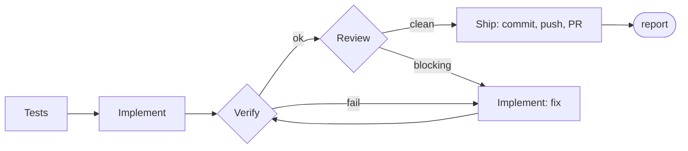

# Workflow

How features get designed and built (ADR-024). Operational version of the approved redesign plan, Część III.

## Agents (`.claude/agents/*.md`)

| Agent | Model / effort | Tools | Preloaded skill | Job | Returns |
|---|---|---|---|---|---|
| `implementer` | sonnet/high (Tier 1); opus/xhigh (Tier 2, or after Tier-1 escalation) | Read, Edit, Write, Glob, Grep, Bash — no `Agent` | `backend-playbook`, `frontend-playbook` | drives tests to green per the spec; updates `requests/*.http`, the TS client, and any rule/ADR it changes the convention of | `{filesTouched[], projects[], commandsRun[], notes[]}` |
| `test-writer` | sonnet/medium | same set | `testing-playbook` | writes failing tests from the spec's acceptance criteria (slice/unit/tenancy/outbox), runs them to confirm red | `{tests[{name,file,ac}], projects[]}` |
| `verifier` | haiku/low | Bash, Read | — | runs `node scripts/verify.mjs --projects …`, parses the result | `{ok, failures[{step,summary,file?}]}` |
| `reviewer` | opus/high | Read, Grep, Glob, Bash — no Edit/Write | `review-checklist` | fresh context; diffs against the spec and the hard rules; flags only what breaks correctness or an acceptance criterion | `{findings[{severity: blocking\|minor, file, line, claim, evidence}]}` |
| `ops` | sonnet/medium | Bash, Read, Edit, Write, Glob, Grep | `ops-playbook` | git on `feat/*`, PR, CI triage, dependabot, runner, `.github/**` | `{branch, prUrl?, ciStatus?}` |
| `Explore` (built-in) | default, skips CLAUDE.md | read-only | — | codebase research for `/design` | text |

Author ≠ reviewer (ADR-024): the reviewer always runs in a clean context and never edits a file.

## Pipeline — `/build <spec> [--tier 1|2] [+Nk]`

- **Verify fails:** up to `maxRounds` (default 2) fix/verify cycles. On Tier 1, the model escalates to opus/xhigh after 2 failed rounds for one final attempt; past that, the run stops with `status: blocked` and the failures.
- **Review has `blocking` findings:** implementer addresses them, verify re-runs; up to `maxRounds` rounds, else `status: blocked`. `minor` findings never block Ship.
- **Ship** always ends in a PR against `master` — the orchestrator never merges, whatever the outcome.
- `/build` is a skill with `disable-model-invocation: true` that calls `Workflow({name: 'build-feature', args})`: control flow is a script (`.claude/workflows/build-feature.js`), not model tokens. Each agent receives the spec's file path and the prior phase's structured output — never the conversation history or a raw diff.
- `+Nk` sets a token budget checked before every phase; going over it returns `status: blocked` with a report, never a silent partial run.
- `resumeFromRunId` resumes a run after a spec fix without repeating phases that already passed.
- **Bugs go through `/fix <bug>`**, not a hand patch: it reproduces first, localizes the root cause (with `Explore`), writes `specs/fix-<slug>.md` whose AC-1 is the reproduction test, and after approval calls the same `build-feature` workflow — so a fix gets the same test-writer → implementer → verifier → reviewer → PR path as a feature, and the diagnostician never reviews its own fix.

## Definition of Ready (before `/build` will accept a spec)

- `status: approved`.
- Every acceptance criterion names a test or a command that proves it.
- `tier` is set (1 or 2).
- "Risks / open questions" is empty.

## Definition of Done

- `node scripts/verify.mjs` is green.
- Review has zero `blocking` findings.
- A PR is open against `master`.
- The spec is flipped to `status: done`, with the PR link filled into its Result section.
- Any rule or ADR the spec touched is updated in the same PR.

## Tier rule

| Tier | When | Starting model |
|---|---|---|
| 1 | well-scoped and mechanical, low ambiguity (e.g. spec-00, spec-01, spec-05, spec-06) | sonnet/high — escalates to opus/xhigh only after 2 failed verify rounds |
| 2 | changes the data model or event contracts; acceptance criteria must close a real behavioral gap (e.g. spec-02, spec-03, spec-04) | opus/xhigh from the start |

`/design` sets the tier when it writes the spec; `/build --tier` overrides it if the estimate was wrong.

## Budgets and escalation

No budget is enforced by default — a `/build` run goes to completion. Passing `+Nk` caps tokens for that run; `budget.remaining()` is checked before every phase, and running out stops the pipeline with `status: blocked` rather than continuing silently or truncating a phase mid-way. Escalation only ever moves toward a stronger model (sonnet → opus), never back down, and only after a real failure — a red verify or a blocking review — never pre-emptively.

## Git conventions

- Branch: `feat/<slug>`, where `<slug>` is the spec's filename stem.
- Commit message: the spec's title.
- PR: opened by the `ops` agent against `master`. **The user always merges — no agent merges, ever.**
- `git-guard` hook: commit/push on `feat/*`, and `gh pr create --base master` from `feat/*`, run without asking; `gh pr merge` always asks; a push to `master` asks; a force-push is denied outright. Legacy lanes (`praca_*`, `[MT]\d`) keep whatever behavior they already had.

## Scripts vs. prompts

What can be a script or a hook is not a prompt (cheaper, deterministic, no drift):

| Concern | Mechanism |
|---|---|
| Verification (format, build, tests; `web/`: typecheck, lint, build, test; OpenAPI-client diff) | `scripts/verify.mjs` — one Node script usable from Bash, hooks and CI alike |
| Formatting | `format-on-edit` hook (`PostToolUse` on Edit/Write); `web/**` → prettier, `.cs` is left to the implementer's own gate |
| Implementer quality gate | `Stop` hook running `verify.mjs --quick` (format + build of touched projects only) — the implementer cannot end its turn on a red build |
| Orchestration | the `Workflow` script (`build-feature.js`) — zero model tokens spent on control flow |

## Cost per feature (indicative — API list prices: Haiku 4.5 $1/$5, Sonnet 5 $2/$10, Opus 5 $5/$25 per MTok)

| Stage | Model | Typical tokens | Cost |
|---|---|---|---|
| `/design` | Opus (main session) | 30–80k | $0.3–0.8 |
| test-writer | Sonnet | 40–100k | $0.1–0.3 |
| implementer (Tier 1 / Tier 2) | Sonnet / Opus | 100–300k | $0.3–0.8 / $0.8–2.5 |
| verifier (×2–3 per run) | Haiku | 10–30k | < $0.1 |
| reviewer | Opus | 40–100k | $0.3–0.8 |
| ops | Sonnet | 10–20k | < $0.1 |
| **Total per feature** | | | **~$1–2 (Tier 1), ~$2–5 (Tier 2)** |

Tier 2 starts on Opus rather than trying Sonnet first: a failed attempt plus its fix-rounds costs more than starting with the stronger model.
