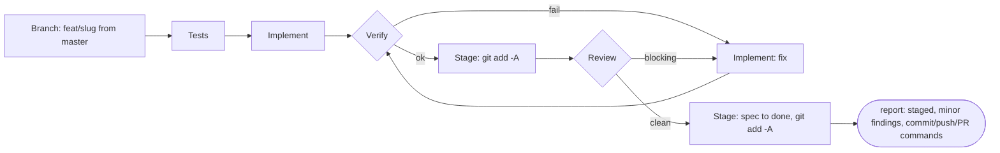

# Workflow

How features get designed and built (ADR-024). Operational version of the approved redesign plan, Część III.

## Agents (`.claude/agents/*.md`)

| Agent | Model / effort | Tools | Preloaded skill | Job | Returns |
|---|---|---|---|---|---|
| `implementer` | sonnet/high (Tier 1); opus/xhigh (Tier 2, or after Tier-1 escalation) | Read, Edit, Write, Glob, Grep, Bash + microsoft-docs, context7, Playwright MCP — no `Agent` | `backend-playbook`, `frontend-playbook` | drives tests to green per the spec; updates `requests/*.http`, the TS client, and any rule/ADR it changes the convention of. Runs **only** `dotnet test --filter` on its own tests (+ `gen:api`/`typecheck` after an API change, `dotnet format` after a migration) — every suite belongs to the verifier | `{filesTouched[], projects[], commandsRun[], notes[]}` |
| `test-writer` | sonnet/high (Tier 1) · opus/high (Tier 2) | Read, Edit, Write, Glob, Grep, Bash + microsoft-docs, context7 | `testing-playbook` | writes failing tests from the spec's acceptance criteria (slice/unit/tenancy/outbox), runs them **filtered** to confirm red | `{tests[{name,file,ac}], projects[]}` |
| `verifier` | haiku/low | Bash, Read | — | runs `node scripts/verify.mjs --projects …`, parses the result | `{ok, failures[{step,summary,file?}]}` |
| `reviewer` | opus/high | Read, Grep, Glob, Bash + microsoft-docs, context7 — no Edit/Write | `review-checklist` | fresh context; diffs the staged change (`git diff --cached`) against the spec and the hard rules; flags only what breaks correctness or an acceptance criterion | `{findings[{severity: blocking\|minor, file, line, claim, evidence}]}` |
| `ops` | sonnet/medium (haiku/low for the mechanical branch/stage phases of a build run) | Bash, Read, Edit, Write, Glob, Grep + GitHub MCP (reads + review comments only) | `ops-playbook` | in a build run: branch + `git add -A`, nothing more; outside one: commits, PRs, CI triage, dependabot, runner, `.github/**` | `{branch, stagedFiles?, notes[]}` |
| `Explore` (built-in) | default, skips CLAUDE.md | read-only | — | codebase research for `/design` and `/fix` | text |

Author ≠ reviewer (ADR-024): the reviewer always runs in a clean context and never edits a file.

**Documentation access:** .NET 10 and Angular 22 are newer than any model's training data, so the three agents that write or judge code reach the doc servers themselves — microsoft-docs for .NET/ASP.NET/EF, context7 for Angular/Material/MassTransit. `ops` holds GitHub MCP for reads and PR review comments only; the `git-guard` hook sees `Bash` alone, so every repository state change stays on `git`/`gh`, and no agent has a merge tool.

## Pipeline — `/build <spec> [--tier 1|2] [--skip tests,review] [+Nk]`

- **Branch first (D1).** `ops` cuts `feat/<slug>` from an up-to-date `master` before a single file is written, and stops the run if the tree holds anything that is not this spec. An interrupted run therefore leaves its work on its own branch, never loose on `master`, and re-running `/build <slug>` picks that branch back up.
- **Stage before review (D2).** After a green verify, `ops` runs `git add -A` so the reviewer diffs `git diff --cached`. A bare `git diff` never shows a brand-new file, and most of a new slice is new files — the index does show them, so staging is enough and no commit is needed.
- **The pipeline never commits, pushes or opens a PR (D3).** It ends with the change staged on its branch and the spec at `status: done`; the commit message, the push and the PR are the user's, written by hand. No agent has ever merged, and now none of them commits either.
- **Verify fails:** up to `maxRounds` (default 2) fix/verify cycles. On Tier 1, the model escalates to opus/xhigh after 2 failed rounds for one final attempt; past that, the run stops with `status: blocked` and the failures.
- **Review has `blocking` findings:** implementer addresses them, verify re-runs; up to `maxRounds` rounds, else `status: blocked`. `minor` findings never block the run — there is no PR to post them on, so they come back in the workflow's report and `/build` prints them, one line each.
- **Skippable phases.** `Tests` and `Review` can be skipped; `Verify` never — it is the definition of green. A spec declares `skip: [tests]` in its frontmatter when it adds and alters no behaviour (deletion, config, docs, a pure move); every acceptance criterion must then be provable by a command, a grep or an existing test class. `/build --skip tests,review` overrides the frontmatter for one run. A spec **without** the flag whose test-writer produces nothing still stops the run — that means its criteria were not testable as written, which is worth knowing.
- `/build` is a skill with `disable-model-invocation: true` that calls `Workflow({name: 'build-feature', args})`: control flow is a script (`.claude/workflows/build-feature.js`), not model tokens. Each agent receives the spec's file path and the prior phase's structured output — never the conversation history or a raw diff.
- `+Nk` sets a token budget checked before every phase; going over it returns `status: blocked` with a report, never a silent partial run.
- `resumeFromRunId` resumes a run inside the same session; across sessions, re-running `/build <slug>` on the existing branch is the recovery path.
- **Bugs go through `/fix <bug>`**, not a hand patch: it reproduces first, localizes the root cause (with `Explore`), writes `specs/fix-<slug>.md` whose AC-1 is the reproduction test, and after approval calls the same `build-feature` workflow — so a fix gets the same test-writer → implementer → verifier → reviewer path as a feature, and the diagnostician never reviews its own fix.
- **Changes to existing behaviour go through `/design`**, not `/fix`: a bug is code failing its own intent, a change is the intent moving. `/design` sends `Explore` after the current implementation first and records it under "Current behaviour" in the spec.

## Definition of Ready (before `/build` will accept a spec)

- `status: approved`.
- Every acceptance criterion names a test or a command that proves it.
- `tier` is set (1 or 2).
- `skip` is set deliberately — `[]` for anything that changes behaviour, `[tests]` only for a spec that changes none.
- "Risks / open questions" is empty.

## Definition of Done

- `node scripts/verify.mjs` is green.
- Review has zero `blocking` findings.
- The whole change is staged on `feat/<slug>` — nothing committed, nothing pushed.
- The spec is flipped to `status: done`, with its Result section saying the change awaits the user's commit and PR.
- Any rule or ADR the spec touched is staged with it.
- The user then commits, pushes and opens the PR by hand, and merges it when CI is green.

## Tier rule

| Tier | When | Starting model |
|---|---|---|
| 1 | well-scoped and mechanical, low ambiguity (e.g. spec-00, spec-01, spec-05, spec-06) | sonnet/high — escalates to opus/xhigh only after 2 failed verify rounds |
| 2 | changes the data model or event contracts; acceptance criteria must close a real behavioral gap (e.g. spec-02, spec-03, spec-04) | opus/xhigh from the start |

`/design` sets the tier when it writes the spec; `/build --tier` overrides it if the estimate was wrong.

## Budgets and escalation

No budget is enforced by default — a `/build` run goes to completion. Passing `+Nk` caps tokens for that run; `budget.remaining()` is checked before every phase, and running out stops the pipeline with `status: blocked` rather than continuing silently or truncating a phase mid-way. Escalation only ever moves toward a stronger model (sonnet → opus), never back down, and only after a real failure — a red verify or a blocking review — never pre-emptively.

## Git conventions

- Branch: `feat/<slug>`, where `<slug>` is the spec's filename stem — cut by `ops`.
- Commit message: the spec's title — written by the **user**, who also pushes and opens the PR. A build run stops at `git add -A`.
- PR: opened by the user against `master`. **The user always merges — no agent merges, ever.**
- An agent commits or pushes only inside an explicit `/ops <task>` that asks for it; never inside `/build` or `/fix`.
- `git-guard` hook: commit/push on `feat/*`, and `gh pr create --base master` from `feat/*`, run without asking; `gh pr merge` always asks; a push to `master` asks; a force-push is denied outright. It is a backstop for the `/ops` lane — the build pipeline no longer reaches it. Legacy lanes (`praca_*`, `[MT]\d`) keep whatever behavior they already had.

## Scripts vs. prompts

What can be a script or a hook is not a prompt (cheaper, deterministic, no drift):

| Concern | Mechanism |
|---|---|
| Verification (format, build, tests; `web/`: typecheck, lint, build, test; OpenAPI-client diff) | `scripts/verify.mjs` — one Node script usable from Bash, hooks and CI alike. It runs **once per Verify phase, in the `verifier` agent only**: the implementer and test-writer run nothing but `--filter`ed tests, so no suite is paid for twice |
| Formatting | `format-on-edit` hook (`PostToolUse` on Edit/Write); `web/**` → prettier, `.cs` is left to the implementer's own gate |
| Implementer quality gate | `Stop` hook running `verify.mjs --quick` (format + build of touched projects only) — the implementer cannot end its turn on a red build |
| Orchestration | the `Workflow` script (`build-feature.js`) — zero model tokens spent on control flow |
| Plan status (which spec stands where, open PRs, rotting branches) | `scripts/plan-status.mjs`, derived from spec frontmatter + git + `gh`. A `SessionStart` hook injects it into every session, so no session ever starts from a stale README; `--write` refreshes the generated block in `skarbiec-plan/README.md`. Only "Open loops" there stays hand-written — that is judgement, not data |

## Cost per feature (indicative — API list prices: Haiku 4.5 $1/$5, Sonnet 5 $2/$10, Opus 5.5 $4/$20 per MTok; `opus` means `claude-opus-5-5`, pinned by full id)

| Stage | Model | Typical tokens | Cost |
|---|---|---|---|
| `/design` | Opus, xhigh (main session) | 30–80k | $0.3–0.8 |
| ops — branch + stage (×1–3 per run) | Haiku | 5–15k each | < $0.1 |
| test-writer (skipped on a no-behaviour spec) | Sonnet / Opus (by tier) | 40–100k | $0.1–0.3 |
| implementer (Tier 1 / Tier 2) | Sonnet / Opus | 100–300k | $0.3–0.8 / $0.8–2.5 |
| verifier (×2–3 per run) | Haiku | 10–30k | < $0.1 |
| reviewer (skippable with `--skip review`) | Opus | 40–100k | $0.3–0.8 |
| ops — final stage (spec → done, `git add -A`) | Haiku | 5–15k | < $0.1 |
| **Total per feature** | | | **~$1–2 (Tier 1), ~$2–5 (Tier 2)** |

Tier 2 starts on Opus rather than trying Sonnet first: a failed attempt plus its fix-rounds costs more than starting with the stronger model.
