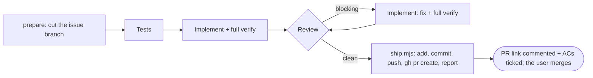

# Workflow

How features get designed and built (ADR-024). A spec is a GitHub issue on the **FinMel project** — never a file in the repo.

## The board

| Field / label | Values | Set by |
|---|---|---|
| Status (built-in) | Todo → In progress → Done | `/design` and `/fix` publish at Todo; `/build` sets In progress; `prepare` cuts the branch with `gh issue develop`, so it is the issue's linked branch and merging its PR closes the issue and the project's "Item closed" workflow sets Done |
| Tier | 1, 2 | `/design` / `/fix`; `/build --tier` overrides for one run |
| Kind | New, Change, Cleanup, Fix | `/design` / `/fix` |
| Branch | `feat/<slug>`, `fix/<slug>` (none on an epic) | `/design` / `/fix` |
| labels | `spec` (buildable), `epic` (umbrella of a split — its sub-issues are built, never the epic), `skip-tests` | `/design` / `/fix` |

**Epics.** Either `/design` or `/fix` — at your request or on its own proposal, at any point of the interview or diagnosis — can split the work into an `epic` with one sub-issue per part. Each part is a full spec with its own tier, kind, branch and ACs, and leaves master green when it merges. Parts are attached in build order and built in that order: `prepare` refuses a part while an earlier sibling is still open, because every branch is cut from master. An already published spec becomes a part with `edit <n> --parent <epic>`. GitHub never closes the epic itself — `plan-status` flags it once every part is Done.

Every board operation goes through `scripts/gh-project.mjs` (`init`, `check`, `create`, `edit`, `get`, `list`, `set`, `prepare`, `report`, `comment`, `tick`) — the one place that knows the project number and its fields. `/board` shows what to build next; the `SessionStart` hook shows the same open issues against git.

## Agents (`.claude/agents/*.md`)

| Agent | Model / effort | Tools | Preloaded skill | Job | Returns |
|---|---|---|---|---|---|
| `implementer` | Tier 1: sonnet/medium; Tier 2: sonnet/high; Tier-1 skip-tests cleanup: haiku/high — escalating once per run to opus/medium (Tier 1) or opus/high (Tier 2); later calls (review fixes) stay escalated | Read, Edit, Write, Glob, Grep, Bash + microsoft-docs, context7, LSP — no `Agent` | `backend-playbook`, `frontend-playbook` | drives tests to green per the spec, owning the design and the tests: fixes a wrong test or a wrong design decision itself and lists each in `deviations` (the reviewer judges each, the run report lists them); updates `requests/*.http`, the TS client, and any rule/ADR it changes the convention of. Runs filtered `dotnet test` while working, then the **full** verification itself before returning: `verify.mjs --all --fix --cache --out .git/verify-result.json` in the background, waited on with `--await` (repeated while `VERIFY_PENDING`, any number of calls); up to 3 fixes in its own context, still red -> `verified: false`. Bash `timeout: 600000` on `dotnet test` and `--await` | `{status, verified, failures[], filesTouched[], projects[], commandsRun[], notes[], deviations[], openQuestions[]}` |
| `test-writer` | haiku/high (Tier 1); sonnet/medium (Tier 2) | Read, Edit, Write, Glob, Grep, Bash + microsoft-docs, context7 | `testing-playbook` | writes failing tests from the spec's acceptance criteria (slice/unit/tenancy/outbox), runs them **filtered** to confirm red | `{tests[{name,file,ac}], projects[], contextFiles[]}` |
| `reviewer` | round 1: opus/medium (Tier 1) or opus/high (Tier 2); round 2+: opus/medium narrow re-review | Read, Grep, Glob, Bash + microsoft-docs, context7 — no Edit/Write | `review-checklist` | fresh context; reads the uncommitted change through `scripts/review-diff.mjs` against the spec and the hard rules; flags only what breaks correctness or an acceptance criterion. A re-review gets the previous blocking findings plus the fix's notes, deviations and `filesTouched`, checks each is resolved and that those files broke nothing, and does not re-run tests to confirm green | `{findings[{severity: blocking\|minor, file, line, claim, evidence}], summary}` |
| `ops` | sonnet/medium | Bash, Read, Edit, Write, Glob, Grep + GitHub MCP (reads + review comments only) | `ops-playbook` | `/ops` chores only: commits, PRs, CI triage, dependabot, runner, `.github/**` — never a merge | `{branch, commit?, prUrl?, notes[]}` |
| `Explore` (project agent, `.claude/agents/explore.md`) | haiku/medium | read-only | — | codebase research for `/design` and `/fix` | text |

Author ≠ reviewer (ADR-024): the reviewer always runs in a clean context and never edits a file.

**Documentation access:** .NET 10 and Angular 22 are newer than any model's training data, so the agents that write or judge code reach the doc servers themselves — microsoft-docs for .NET/ASP.NET/EF, context7 for Angular/Material/MassTransit. `ops` holds GitHub MCP for reads and PR review comments only; the `git-guard` hook sees `Bash` alone, so every repository state change stays on `git`/`gh`, and no agent has a merge tool.

## Pipeline — `/build #<issue> [--tier 1|2] [--skip tests,review] [+Nk]`

```mermaid
flowchart LR
    B[prepare: cut the issue branch] --> T[Tests]
    T --> I[Implement + full verify] --> R{Review}
    R -- blocking --> IF[Implement: fix + full verify] --> R
    R -- clean --> S[ship.mjs: add, commit, push, gh pr create, report]
    S --> Done([PR link commented + ACs ticked; the user merges])
```

- **Branch first (D1).** `gh-project.mjs prepare` cuts the issue's branch from an up-to-date `master` (it always runs `git fetch origin` and fast-forwards local `master` to `origin/master` first, so `master...HEAD` diffs are correct; then `gh issue develop … --checkout`, or `git switch` when it exists) before the card moves and before a single file is written. A dirty tree stops it with `{ok:false, stage:"branch", reason, files, next}`. An interrupted run therefore leaves its work on its own branch, never loose on `master`, and re-running `/build #<n>` picks that branch back up.
- **Review reads the uncommitted change (D2).** Nothing is staged or committed before the review. `node scripts/review-diff.mjs --stat` lists the change, `-- <path>` shows a file's diff (untracked new files included), no argument shows everything; the index is never touched.
- **The pipeline ships, the user merges (D3).** The workflow returns `status: "ready"` (or `"blocked"`) plus `nextCommand`, a `node scripts/ship.mjs <issue> --branch … --title … --json '…' [--blocked]` line that `/build` runs verbatim as one Bash call. `ship.mjs` guards the lane (feat/fix/chore, never `master`), runs `verify.mjs --all --cache-check` (a cache miss blocks the ship: the tree was not proven green), then `git add -A`, commits (the spec's title, `Spec: #<n>`, the co-author trailer), `push -u`, `gh pr create --base master` (or reuses the open PR), then posts the run report via `gh-project.mjs report`. A failure posts a blocked report (stage `ship`); `--blocked` only posts the report. Its last stdout line is `SHIP_RESULT: {"ok","branch","commit","prUrl","reportPosted","failedCommand"?,"error"?}` (exit 0/2). No agent merges, ever.
- **A running stack never blocks a run (D4).** The local stack (Aspire AppHost, services, `ng serve`) locks build outputs and `node_modules` binaries. `verify.mjs` stops it itself on MSB3021/3026/3027 and retries the build; any agent blocked by it (locked file, port in use) runs `node scripts/stop-stack.mjs` and retries once. Nothing restarts the stack — that is the user's.
- **Preflight before `prepare`.** `/build` and `/fix` run `node scripts/preflight.mjs` before `gh-project.mjs prepare`, so a missing prerequisite stops the run before the card moves. It fixes what it safely can — starts Docker Desktop and waits for the daemon, stops a running stack (`stop-stack.mjs`), runs `npm ci` in `web/` when `node_modules` is missing or older than `package-lock.json` — and only reports what needs the user: Node/.NET SDK versions, `gh` login and token scopes (`repo`, `project`), the git remote. `--dry-run` never changes anything; `--no-web` skips the npm check.
- **Implementer red:** it makes up to 3 fixes in its own context; still red (or blocked) -> exactly one escalation per run: a fresh implementer on the escalated level (Tier 1 sonnet/medium or haiku/high -> opus/medium; Tier 2 sonnet/high -> opus/high), given the previous failures, notes and deviations and the tree on disk, also with 3 fixes. If it fails too, the run stops `status: blocked` at stage `implement`. After escalating, later implementer calls (review fixes) stay escalated.
- **Review has `blocking` findings:** the implementer addresses them through the same attempt + escalation path and re-verifies fully; the reviewer then re-reviews narrowly (opus/medium); up to `maxRounds` (2) review rounds, else `status: blocked`. `minor` findings never block the run — they come back in the workflow result, and `/build` prints them; `ship.mjs` posts them on the issue.
- **Skippable phases.** `Tests` and `Review` can be skipped; the implementer's full verification never — it is the definition of green. A spec issue carries the `skip-tests` label when it adds and alters no behaviour (deletion, config, docs, a pure move); every acceptance criterion must then be provable by a command, a grep or an existing test class. `/build --skip tests,review` overrides the label for one run. A spec **without** the flag whose test-writer produces nothing still stops the run — that means its criteria were not testable as written, which is worth knowing.
- `/build` is a skill with `disable-model-invocation: true` that calls `Workflow({name: 'build-feature', args})`: control flow is a script (`.claude/workflows/build-feature.js`), not model tokens. `/build` first writes the issue body to a gitignored local copy (`skarbiec-plan/issues/<n>.md`, via `gh-project.mjs get --out`); each agent receives that path, the branch and title, and the prior phase's structured output — never the conversation history or a raw diff.
- **How to run.** `/design` and `/fix` in an Opus session (fresh is best: `/clear`). `/build` in a fresh session or `claude --model haiku "/build #<n>"`: a skill whose `model:` differs from the session model re-reads the whole history uncached, twice (there and back), and a subagent cannot call the `Workflow` tool, so `/build` cannot be forked.
- `+Nk` sets a token budget checked before every phase; going over it returns `status: blocked` with a report, never a silent partial run.
- `resumeFromRunId` resumes a run inside the same session; across sessions, re-running `/build #<n>` on the existing branch is the recovery path.
- **Bugs go through `/fix <bug>`**, not a hand patch: it reproduces first, localizes the root cause (with `Explore`), publishes a `Fix`-kind issue on `fix/<slug>` whose AC-1 is the reproduction test (or, for several root causes or a fix that must land in sequence, an epic of such issues, building the first), and after approval runs the same `/build` steps — so a fix gets the same test-writer → implementer → reviewer path as a feature, and the diagnostician never reviews its own fix.
- **Changes to existing behaviour go through `/design`**, not `/fix`: a bug is code failing its own intent, a change is the intent moving. `/design` sends `Explore` after the current implementation first and records it under "Current behaviour" in the spec. A spec that needs fixing is amended in place (`gh issue edit`), never duplicated.

## Definition of Ready (before `/build` will accept a spec)

- An open issue on the project with the `spec` label, Status Todo (or In progress for a resumed run), and a Branch — publishing it at all means you approved it in `/design`.
- Every acceptance criterion is a checkbox that names a test or a command that proves it.
- Tier is set (1 or 2).
- `skip-tests` is set deliberately — only on a spec that changes no behaviour.
- No open question left in the body.

## Definition of Done

- `node scripts/verify.mjs --all` is green, run by the implementer; `ship.mjs` re-checks it with `--cache-check`.
- Review has zero `blocking` findings.
- The whole change is committed on the issue's branch, pushed, and its PR against `master` is open.
- The run report, with the PR link, is commented on the issue and its acceptance criteria are ticked.
- Any rule or ADR the spec touched is in the same commit.
- The user merges the PR when CI is green — which closes the issue and moves the card to Done.

## Tier rule

| Tier | When | Starting model |
|---|---|---|
| 1 | well-scoped and mechanical, low ambiguity (e.g. spec-00, spec-01, spec-05, spec-06) | test-writer haiku/high, implementer sonnet/medium (a skip-tests cleanup: haiku/high), escalating once to opus/medium; reviewer opus/medium |
| 2 | changes the data model or event contracts; acceptance criteria must close a real behavioral gap (e.g. spec-02, spec-03, spec-04) | test-writer sonnet/medium, implementer sonnet/high, escalating once to opus/high; reviewer opus/high |

`/design` sets the tier when it writes the spec; `/build --tier` overrides it if the estimate was wrong.

## Budgets and escalation

No budget is enforced by default — a `/build` run goes to completion. Passing `+Nk` caps tokens for that run; `budget.remaining()` is checked before every phase, and running out stops the pipeline with `status: blocked` rather than continuing silently or truncating a phase mid-way. Escalation happens at most once per run, only toward a stronger model (haiku/sonnet -> opus), never back down, and only after a real failure — an implementer still red after its 3 fixes — never pre-emptively.

## Git conventions

- Branch: the issue's Branch field — `feat/<slug>`, or `fix/<slug>` for a fix — cut by `gh-project.mjs prepare`.
- Commit message: the spec's title, a `Spec: #<n>` line and the co-author trailer — made by `ship.mjs`.
- PR: opened by `ship.mjs` against `master` from the issue's linked branch — no `Closes #<n>` needed. **The user always merges — no agent merges, ever.**
- No agent runs a git mutation in a build run (`/build`, `/fix`): `prepare` cuts the branch and `ship.mjs` commits and pushes. Otherwise only `ops` inside an explicit `/ops <task>` that asks for it.
- `git-guard` hook: commit/push on `feat/*`, `fix/*`, `chore/*`, and `gh pr create --base master` from those, run without asking; `gh pr merge` always asks; a push to `master` asks; a force-push is denied outright. A prompt during the Ship step means a command left the lane — `ship.mjs` refuses and posts a blocked report. Legacy lanes (`praca_*`, `[MT]\d`) keep whatever behavior they already had.

## Scripts vs. prompts

What can be a script or a hook is not a prompt (cheaper, deterministic, no drift):

| Concern | Mechanism |
|---|---|
| Verification (format, build, tests; `web/`: typecheck, lint, build, test; OpenAPI-client diff) | `scripts/verify.mjs` — one Node script usable from Bash, hooks and CI alike. Test projects run one at a time by default (`--jobs N` runs N at once alongside web, but parallel Testcontainers suites deadlock and time out on this machine), then the web block; every failure is reported, not only the first. Format is `dotnet format --verify-no-changes` scoped to the changed `.cs` files (the whole solution with `--all`, an `.editorconfig` change or an unclassifiable change). A new run kills the previous one via `.git/verify.pid`. The implementer runs it once (`--all --fix --cache`); `ship.mjs` only checks the cache (`--cache-check`). Agents otherwise run nothing but `--filter`ed tests |
| Formatting | `format-on-edit` hook (`PostToolUse` on Edit/Write); `web/**` → prettier. Whatever slips through (`.cs`, files written from Bash, lint autofixes) is fixed by `verify.mjs --fix`, so a formatting slip never costs a model round |
| Verify that cannot hang | `verify.mjs` has a 120-min run deadline that kills the whole process tree; the implementer starts it in the background with `--out .git/verify-result.json` and waits with `--await` (≤ 9 min per call, repeated while `VERIFY_PENDING`); a run that died or passed its deadline reports `step: timeout` |
| Build prerequisites | a spec's `## Depends on` section; `gh-project.mjs prepare` refuses while a listed issue is open |
| Token accounting | `scripts/run-cost.mjs` — $ at list prices per run and per agent type: model calls, cache read/write, largest context, share of exploring Bash calls; `--sessions` = main sessions per command + Explore; `--timeline [--issue n]` = per-agent wall time, verify time and `dotnet test` time of the newest run |
| Orchestration | the `Workflow` script (`build-feature.js`) — zero model tokens spent on control flow |
| Board mechanics | `scripts/gh-project.mjs`: `check`/`create`/`edit` clean a draft (HTML comments, empty sections) and refuse one without Goal, Out of scope or a `proof:` per AC; `prepare` decides whether an issue is buildable, writes its local copy, resolves tier/skips, cuts or switches the issue branch (refusing a dirty tree before the card moves), moves the card and prints the exact workflow args; `report` formats and posts the run report and ticks the ACs. `scripts/review-diff.mjs` shows the reviewer the uncommitted change; `scripts/ship.mjs` guards the lane, commits, pushes, opens the PR and posts the report. So `/build` and `/board` run on Haiku as relays and no agent touches git in a build run |
| Plan status (which spec stands where, open PRs, rotting branches) | `scripts/plan-status.mjs`, derived from the project's spec issues + git + `gh`. A `SessionStart` hook injects it into every session, so no session ever starts from a stale README; `--write` refreshes the generated block in `skarbiec-plan/README.md`. Only "Open loops" there stays hand-written — that is judgement, not data |

## Cost per feature (API list prices: Haiku 5.5 $0.10/$0.50 per MTok up to a 100k prompt, $0.50/$2.50 above; Sonnet 5.5 $2/$10, Opus 5.5 $4/$20; cache reads 0.1x input - $0.20 on both Sonnet 5.5 and Opus 5.5; `opus` means `claude-opus-5-5`, pinned by full id)

| Stage | Model | Typical tokens | Cost |
|---|---|---|---|
| `/design` | Opus, xhigh (main session) | 30–80k | $0.3–0.8 |
| test-writer (skipped on a no-behaviour spec) | Haiku high (Tier 1) / Sonnet medium (Tier 2) | 40–100k | < $0.1 / $0.1–0.3 |
| implementer incl. full verification (Tier 1 / Tier 2) | Sonnet medium / Sonnet high; Opus medium / high on escalation | 100–300k | $0.2–0.6 / $0.5–1.5 (Opus: $0.3–0.8 / $0.8–2.5) |
| reviewer (skippable with `--skip review`) | Opus medium (Tier 1) / Opus high (Tier 2) | 40–100k | $0.3–0.8 |
| `ship.mjs` (commit, push, PR, report) | script | 0 | $0 |
| **Total per feature** | | | **~$1–2 (Tier 1), ~$2–5 (Tier 2)** |

The estimates above predate measurement. `node scripts/run-cost.mjs` over 29 runs (2026-09-24 → 10-02) found ~13.8M cache-read tokens per run, 51 % in the implementer and 39 % in the test-writer, half of their Bash calls exploring the code — hence the spec's `## Code map`, the agents' "Read cheaply" rules and the > 8 AC split signal. Re-run it for current numbers.

Measured 2026-09 (transcripts, list prices): Tier 1 averaged **$1.7** per run, Tier 2 (then opus/xhigh implementer + opus/high test-writer) **$6.9** (range $2–13) — implementer ~50%, test-writer ~30%, reviewer ~15%, Haiku phases < 2%. Cost splits roughly 45% cache writes (1h TTL = 2× input), 35% cache reads, 15% output: since cache reads cost the same on Sonnet 5.5 and Opus 5.5, moving a role to Sonnet saves ~30% of it, not 50%. The token counts above are per-call context, not totals — a run makes 60–230 calls.

Measured 2026-10-08 (#200, tier 2, old opus/high flow with a verifier): 89 min, $5.4 — ~58 min of it verification, ~25 min wasted by a Stop hook that ran after the agent had returned.

Every tier starts below Opus and escalates once: a green first attempt is cheaper, and the single escalation caps the cost of a miss.
